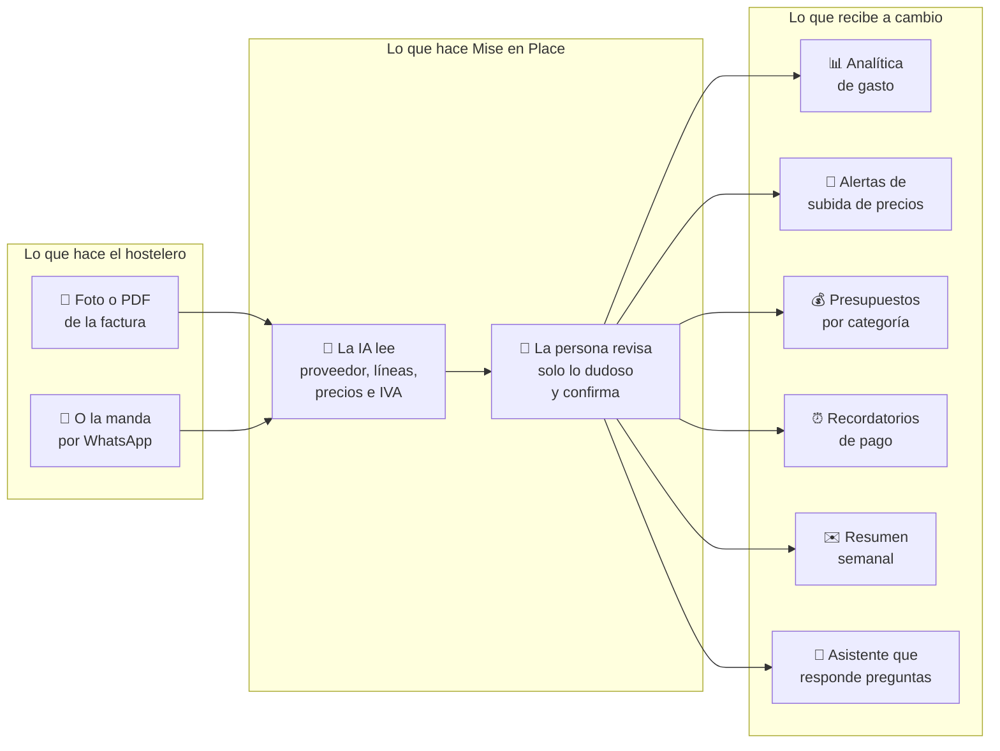

# 1 · Qué es Mise en Place

> *Mise en place* es un término de cocina: tenerlo todo preparado y en su sitio
> antes de que empiece el servicio. Ese es el nombre y esa es la promesa.

## El problema, en una escena

Son las once de la noche. El dueño de un restaurante de 40 cubiertos cierra la
persiana y se sienta con un taco de papeles: albaranes del pescadero, la factura
del distribuidor de bebidas, un ticket del súper. Tiene tres opciones:

1. Teclearlos uno a uno en una hoja de cálculo (nadie lo hace más de dos
   semanas).
2. Meterlos en una carpeta y mandárselos al gestor a fin de mes (lo habitual).
3. No hacer nada (también habitual).

En los tres casos **el dato se pierde**. Y con él, la única forma de darse cuenta
de que el mismo proveedor le ha subido la merluza un 12 % en tres entregas
seguidas.

Los números del sector:

| Dato | Cifra |
|---|---|
| Documentos de proveedor que recibe un restaurante medio | 200–400 al mes |
| Horas semanales que el hostelero dedica a administración | ~14 h |
| Margen neto típico del sector | 3–5 % |
| Peso del coste de materia prima sobre ventas (*food cost*) | 28–35 % |
| Subida acumulada de la cesta de alimentos desde 2021 | +35 % |

El coste de la comida es el mayor gasto que el restaurante **puede** controlar.
Y hoy se controla a ciegas.

## La solución, en un dibujo

El truco no es leer la factura. Leer facturas ya es casi gratis gracias a los
modelos de IA modernos. **El valor está en lo que pasa después**: convertir años
de facturas en un histórico de precios por ingrediente y proveedor que le dice
al hostelero cuándo le están subiendo el precio y cuándo toca renegociar.

## Por qué ahora

Tres fuerzas a la vez — esto es el corazón de casi cualquier mensaje de
marketing que escribas:

1. **Dolor económico récord.** Inflación alimentaria de dos dígitos por producto
   (el café subió un 54 % en 2025; el aceite de oliva se duplicó y se desplomó),
   con la rentabilidad del sector cayendo pese a facturar más.
2. **Obligación legal inminente.** Entre 2027 y 2028 todos los restaurantes
   españoles tendrán que usar facturación certificada (**VERI\*FACTU**) y
   recibir factura electrónica estructurada de sus proveedores. Digitalizar la
   factura deja de ser opcional. *Nosotros montamos la ola; no la creamos.*
3. **Salto tecnológico.** Los modelos multimodales leen un albarán arrugado
   fotografiado en una cocina por menos de un céntimo. Con el OCR clásico
   (el "escáner de texto" de hace diez años) esto era imposible, y por eso la
   generación anterior de competidores se quedó a medias.

## Cómo gana dinero

Suscripción mensual por local, con prueba de 30 días. Tres planes de pago:

| Plan | Facturas al mes | Locales | Extras |
|---|---|---|---|
| **Starter** | 100 | 1 | Lo básico: subir, revisar, analítica, presupuestos |
| **Pro** | 300 | 1 | + resumen semanal, control de stock, asistente IA |
| **Business** | ilimitado | hasta 5 | + multi-local y soporte prioritario |

Los precios son **provisionales** (29 / 59 / 129 € al mes en la app hoy) y el
plan de negocio maneja una horquilla comercial de 49–199 €. Antes de publicar
cualquier precio en un material de marketing, **pregunta**: es una de las cosas
que aún no está cerrada.

Diferencia frente al sector: los competidores venden con presupuesto a medida y
comercial de por medio. Nosotros apostamos por **precio público, alta en
minutos y sin llamada de ventas**.

## Lo que Mise en Place NO es

Esto evita malentendidos en textos de marketing y en conversaciones con leads:

- ❌ **No emite facturas.** Solo lee las que el restaurante *recibe* de sus
  proveedores. (Por eso no somos un sistema certificado VERI\*FACTU, aunque
  sepamos leer y verificar los que lo son.)
- ❌ **No es un TPV** ni sustituye a la caja registradora.
- ❌ **No es un programa de contabilidad.** No sustituye a la gestoría — de
  hecho, la gestoría es un canal de distribución previsto, no un competidor.

## Si quieres profundizar

- `docs/02_product/product_definition.md` — la definición formal de producto
- `docs/02_product/plan_de_negocio.md` — mercado, unit economics, ronda y hoja de ruta
- [[docs/onboarding/04_mercado_y_clientes|4 · Mercado y clientes]]
