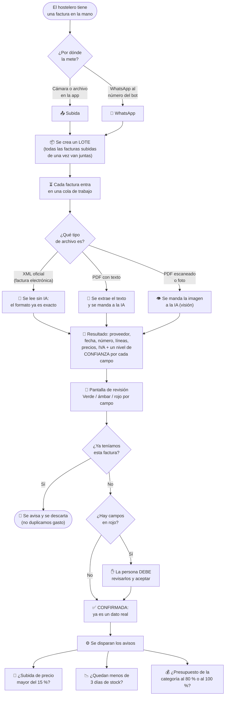
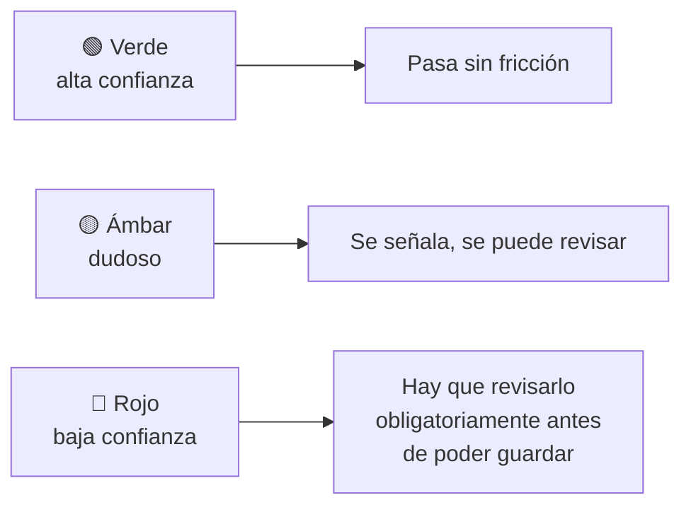

# 2 · El viaje de una factura

Este es el recorrido completo, de la foto al aviso de "te han subido el precio".
Si entiendes este documento, entiendes el 80 % del producto.

## El recorrido completo

## Las cinco ideas clave

### 1. Todo empieza con un **lote**

Cuando alguien sube cinco fotos de golpe, no son cinco procesos sueltos: son un
**lote** (en el código, `batch`). El lote es la unidad que el usuario ve, revisa
y confirma. Verás la palabra *batch* constantemente en reuniones y en la URL de
la pantalla de revisión.

### 2. La IA no lee todo igual

Antes de gastar un céntimo en IA, el sistema mira **qué tipo de archivo es**:

| Tipo de archivo | Qué se hace | Por qué |
|---|---|---|
| **XML** de factura electrónica | Se lee directamente, **sin IA** | El formato ya es estructurado y exacto; la IA solo añadiría errores y coste |
| **PDF con texto** | Se saca el texto y se le pasa a la IA | Más barato y más fiable que mandar la imagen |
| **PDF escaneado o foto** | Se manda la imagen a la IA | No hay texto que sacar; hace falta "vista" |

Esto se llama internamente **clasificación de archivo**, y es una decisión de
arquitectura registrada (ADR-006). Traducción para marketing: *"funciona igual
con el albarán arrugado que con la factura electrónica del distribuidor grande,
sin que el usuario tenga que elegir nada"*.

### 3. La **confianza** por campo es el corazón de la experiencia

La IA no devuelve solo "el total es 342,10 €". Devuelve "el total es 342,10 € y
estoy segura al 94 %". Cada campo lleva su propio nivel:

**Esta es la regla de producto más importante del proyecto:** un importe nunca
se guarda como dato bueno sin que una persona lo haya validado cuando la
máquina dudaba. Es lo que nos separa de un "OCR que a veces se inventa cosas", y
es un argumento de venta directo frente a la desconfianza natural del hostelero.

El campo dudoso se enfoca solo, para que el usuario no tenga que buscarlo.

### 4. Confirmar es el momento de la verdad

Hasta que alguien pulsa **Confirmar**, lo extraído es un borrador. Después, pasa
a ser una **factura canónica**: el registro financiero oficial dentro de la app.
Todo lo demás (analítica, presupuestos, alertas) se calcula **solo** sobre
facturas confirmadas.

También hay un guardián contra duplicados: si el mismo documento se sube dos
veces (algo constante cuando dos personas del equipo suben lo mismo), el sistema
lo detecta y lo bloquea antes de duplicar el gasto.

### 5. Los avisos se calculan al guardar, no de madrugada

En cuanto una factura se confirma, se comprueban tres cosas al instante:

| Aviso | Cuándo salta |
|---|---|
| **Shock de precio** | El precio unitario se desvía más de un 15 % respecto a la mediana de las últimas compras del mismo producto al mismo proveedor |
| **Stock bajo** | Al ritmo de consumo actual, quedan menos de 3 días de producto |
| **Presupuesto** | El gasto del mes en esa categoría llega al 80 % (aviso) o supera el 100 % (excedido) |

Que sea inmediato importa para el mensaje comercial: el hostelero se entera **el
día que recibe la mercancía**, no cuando el gestor cierra el trimestre.

## Lo que puede salir mal (y cómo lo llamamos)

Vas a oír estas situaciones. Conviene reconocerlas:

| Lo que oyes | Qué significa en cristiano |
|---|---|
| *"Se ha quedado en extracting"* | La factura está en la cola y la IA aún no ha terminado, o el proceso que procesa la cola está caído |
| *"Está en dead letter"* | Se intentó procesar varias veces y falló siempre; queda apartada para revisión manual |
| *"Ha saltado el gate de baja confianza"* | La IA dudó de algún campo y la app obliga a revisarlo antes de guardar |
| *"Es un duplicado por content hash"* | El sistema reconoció que ese documento exacto ya estaba subido |
| *"Se ha consumido cuota"* | Cada factura extraída descuenta del cupo mensual del plan (100 / 300 / ilimitado) |

## Si quieres profundizar

- `docs/03_features/invoice_ingestion.md` — cómo entran las facturas
- `docs/03_features/invoice_extraction.md` — cómo se leen
- `docs/03_features/invoice_confirmation.md` — cómo se confirman
- `docs/06_decisions/extraction/ADR-006-file-classification-routes-extraction.md`
  — la decisión de clasificar el archivo antes de extraer
