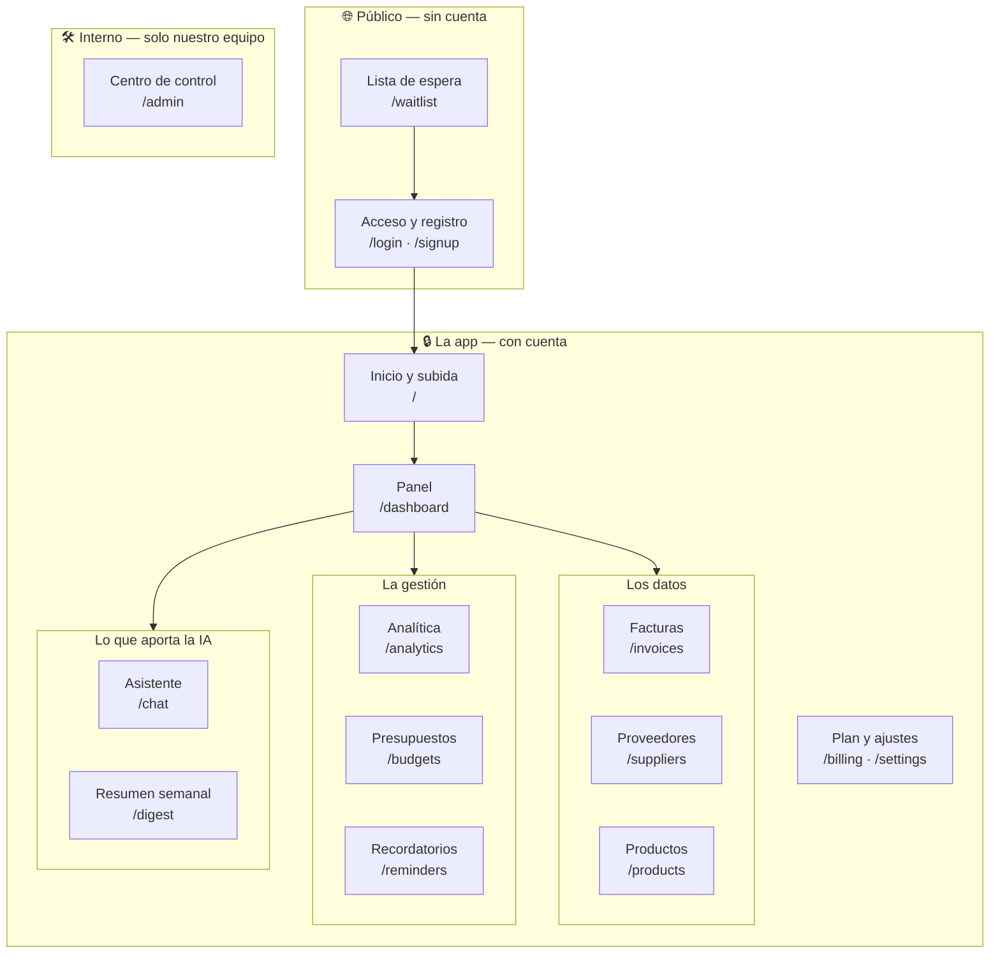

# 3 · Mapa de la app

Cada pantalla, qué hace, y cómo la llama el equipo. La columna **Dirección** es
lo que se ve en la barra del navegador: cuando alguien dice *"eso está en
`/suppliers`"*, se refiere a esa pantalla.

## Vista general

## Pantalla por pantalla

### Lo público

| Pantalla | Dirección | Qué hace | Por qué te importa |
|---|---|---|---|
| **Lista de espera** | `/waitlist` | Landing bilingüe (es/en) con la propuesta de valor, cómo funciona, precios provisionales y captura de email | Es **tu** territorio principal: es la única página que ve un desconocido hoy. Los precios ahí están escritos a mano y hay que cambiarlos a mano (issue #439) |
| **Acceso / registro** | `/login`, `/signup` | Entrar con email y contraseña o con Google | Cualquier fricción aquí mata la conversión desde la landing |

### El día a día del cliente

| Pantalla | Dirección | Qué hace |
|---|---|---|
| **Subida** | `/` | Arrastrar archivos o hacer foto. Funciona **sin cobertura**: si la cocina no tiene señal, la subida se queda en cola en el móvil y se envía sola al recuperar conexión |
| **Revisión del lote** | `/batch/[id]` | La pantalla donde se repasa lo que leyó la IA, con los colores de confianza, y se confirma. El corazón del producto |
| **Panel** | `/dashboard` | Gasto del mes, tendencia, avisos abiertos, indicadores principales |
| **Facturas** | `/invoices` | Listado, detalle, editar, marcar como pagada, ver el documento original, exportar a Excel |
| **Proveedores** | `/suppliers` | Se crean solos a partir de las facturas. Gasto por proveedor, evolución de sus precios, fiabilidad, datos de contacto |
| **Productos** | `/products` | El catálogo normalizado. Aquí se resuelve que "TOMATE PERA 5KG" y "Tomate pera caja 5 kg" son el mismo producto |
| **Analítica** | `/analytics` | Gasto por categoría y periodo, evolución de precios, calidad de la extracción |
| **Presupuestos** | `/budgets` | Límite mensual por categoría de compra, con barras de progreso y avisos de desvío |
| **Recordatorios** | `/reminders` | El centro único de "cosas que requieren atención": facturas vencidas o próximas a vencer **y** todas las alertas (subidas de precio, stock bajo, presupuesto pasado) |
| **Asistente** | `/chat` | Preguntas en lenguaje natural sobre los propios datos: *"¿cuánto gasté en pescado este mes?"* |
| **Resumen semanal** | `/digest` | Resumen generado por IA de lo que ha pasado en la semana; también llega por email |
| **Plan** | `/billing` | Planes, prueba, pago con tarjeta |
| **Ajustes** | `/settings` | Perfil, datos del restaurante, locales adicionales, vincular WhatsApp |

### Lo interno (nuestro equipo, no el cliente)

| Pantalla | Dirección | Qué hace |
|---|---|---|
| **Centro de control** | `/admin` | Salud del sistema, eventos, errores, métricas de ingresos, trabajos fallidos |

No es una pantalla de cliente y **no debe aparecer en ningún material de
marketing ni captura de pantalla pública**.

## Tres cosas que sorprenden al principio

**El teléfono y el ordenador son pantallas distintas de verdad.** No es la misma
página "encogida": hay una versión móvil y una versión escritorio de cada
pantalla. Cuando pidas una captura o un cambio visual, **di siempre para cuál de
las dos**.

**Todo está en español y en inglés.** Cada texto que ve el usuario vive en una
tabla única de traducciones, y hay una comprobación automática que impide
publicar si alguien escribió un texto suelto sin traducir. Si propones una frase
nueva para la interfaz, ten lista **la versión española y la inglesa**.

**Cada restaurante vive en su burbuja.** Un usuario nunca puede ver datos de otro
restaurante; en el equipo esto se llama **aislamiento por inquilino**
(*multi-tenant*). Los clientes con varios locales cambian de local con un
selector, y en el plan Business ven hasta cinco.

## Si quieres profundizar

- `docs/01_architecture/routing_and_navigation.md` — el mapa completo de rutas
- `docs/03_features/` — un documento por funcionalidad
- `docs/06_decisions/experience/ADR-020-both-viewports-rendered-css-chooses.md`
  — por qué móvil y escritorio son componentes distintos
