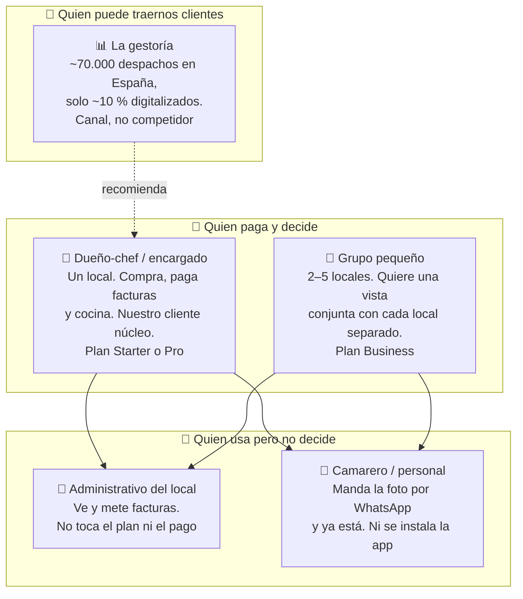
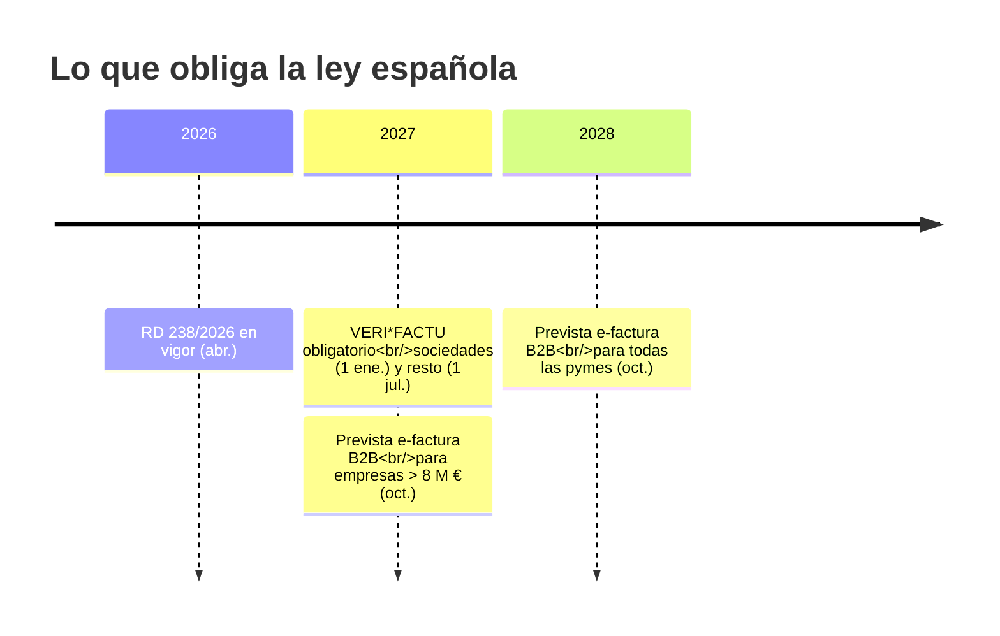
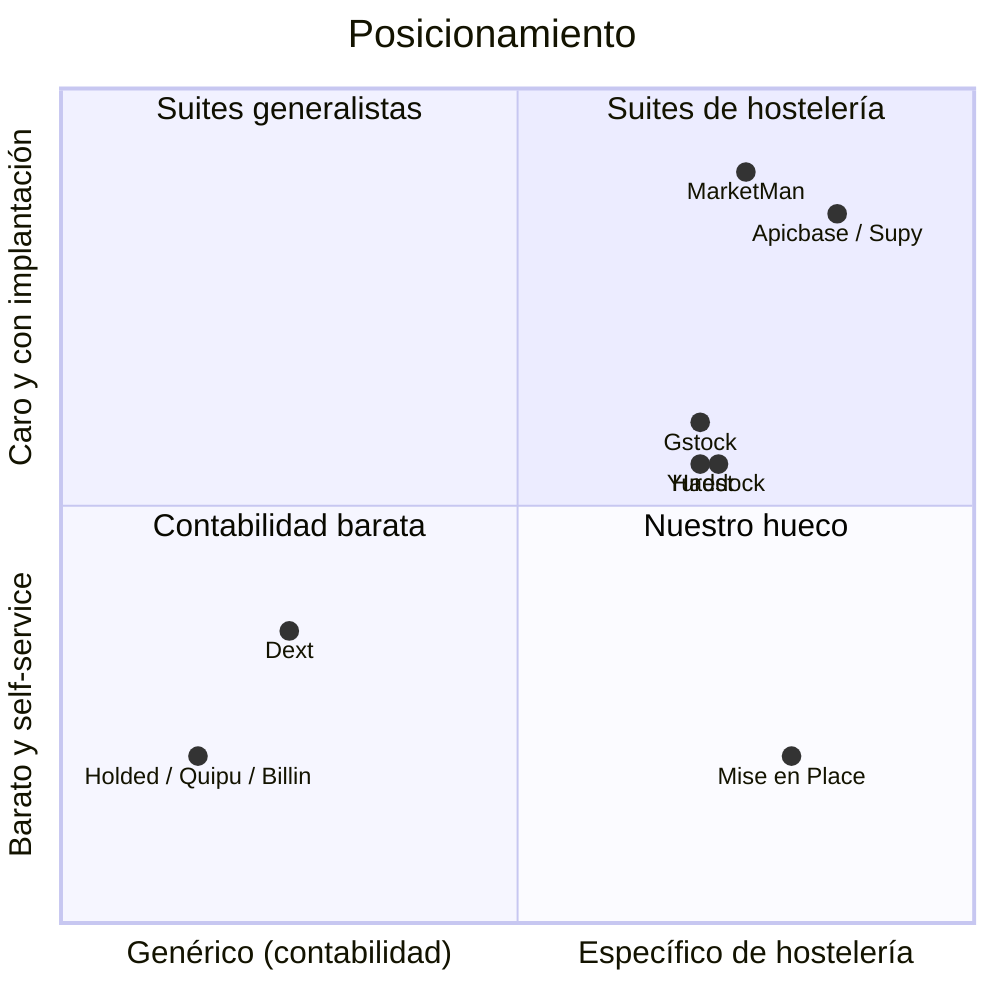

# 4 · Mercado y clientes

Este es el documento más directamente útil para un perfil de marketing e
investigación. Todo lo de aquí está resumido de `docs/PLAN_DE_NEGOCIO.md`, que
es la fuente oficial.

## A quién le vendemos

El **camarero que manda la foto por WhatsApp** merece atención especial: es la
razón de existir del canal de WhatsApp. El personal de cocina ya manda fotos de
albaranes por WhatsApp hoy, sin que nadie se lo pida. En vez de pelear contra
esa costumbre, el bot responde con un enlace de revisión. Es un argumento de
adopción muy potente: **cero formación, cero app que instalar**.

## El tamaño del mercado

| Nivel | Qué significa | Cifra |
|---|---|---|
| **TAM** | Todo el mercado teórico en España (~280.000 establecimientos de restauración) | ≈ 250 M €/año |
| **SAM** | La parte a la que podemos vender de verdad (~150.000 independientes con volumen real de proveedores) | ≈ 135 M €/año |
| **SOM** | Objetivo realista a 3 años (~1.800 locales, un 1,2 % del SAM) | ≈ 1,8 M € de ingresos recurrentes |
| **Europa** | ~1,5 M de establecimientos; Italia tiene una estructura casi idéntica | > 1.300 M €/año |

Dato de encuadre: el 93 % de los restaurantes españoles son independientes. No
es un mercado de cadenas.

## El calendario regulatorio (memorízalo)

Es nuestro mejor gancho de contenido y de campañas, porque tiene fechas.

- **VERI\*FACTU**: obliga a usar un programa de facturación certificado e
  inalterable, con código QR. Afecta a lo que el restaurante **emite**.
- **Factura electrónica B2B** (Ley Crea y Crece): obliga a **emitir y recibir**
  facturas en formato estructurado y a informar de si se han pagado.

**Ojo con el matiz al comunicar:** nosotros no emitimos facturas, así que
Mise en Place **no es** un sistema certificado VERI\*FACTU. Lo que hacemos es
leer y verificar los QR VERI\*FACTU de las facturas que el restaurante *recibe*,
y estar preparados para recibir e-facturas estructuradas. Decir "cumple con
VERI\*FACTU" sería falso y peligroso; decir "preparado para la factura
electrónica que vas a empezar a recibir" es exacto.

## Contra quién competimos

Los tres grupos, en cristiano:

1. **Los genéricos baratos** (Holded, Quipu, Billin, Dext — de 7 a 50 €/mes).
   Sacan la cabecera de la factura para los impuestos. **Ninguno** baja al
   precio por línea de ingrediente ni convierte unidades. No saben lo que vale
   un kilo de merluza; saben lo que suma la factura.
2. **Las suites de hostelería** (Haddock, Gstock, Yurest, MarketMan, Apicbase).
   Hacen escandallos e inventario. Precio opaco, venta con comercial de por
   medio, implantación larga. Punto débil recurrente en sus reseñas: **la
   precisión del escaneo** — MarketMan acumula quejas de que falla la mitad de
   las veces.
3. **Los de pedidos** (Choco, Rekki). Juegan a otra cosa: conectar restaurante
   y proveedor para pedir. No hacen analítica de coste.

**Nuestro hueco:** específico de hostelería como el grupo 2, pero con precio
público, alta en minutos y valor visible con la primera factura (objetivo:
menos de 10 minutos desde el registro hasta el primer dato útil).

**Señal de que el mercado es real:** xtraCHEF, el mismo producto en EE. UU., lo
compró Toast por ~23,5 M $. MarginEdge levantó 45 M $ con 4.000 restaurantes. En
España solo hay **un** competidor financiado (Haddock, 1 M €). El hueco es
evidente.

## Aviso importante sobre los precios

Ahora mismo conviven **dos tablas de precios distintas** en la casa:

| Fuente | Precios |
|---|---|
| La app y la landing hoy | 29 / 59 / 129 € al mes |
| El plan de negocio (versión inversores) | 49 / 99 / 199 € al mes |

Los de la app están marcados explícitamente como **provisionales** y no están
cerrados. Además, están escritos por duplicado en dos sitios que no se hablan
entre sí (es un fallo conocido, issue #439).

👉 **No publiques ningún precio en un material externo sin confirmarlo antes.**

## Ideas de trabajo que encajan con este perfil

Nada de esto está asignado; es para que veas dónde puede aterrizar tu rol:

- **Investigación primaria**: hablar con hosteleros y validar la estimación de
  200–400 documentos al mes por local, que hoy es una cifra sectorial sin
  contrastar por nosotros.
- **Contenido regulatorio**: las fechas de 2027–2028 se prestan a guías
  prácticas ("qué te va a pedir la ley y cuándo") que atraen tráfico cualificado
  y no dependen de que el producto esté lanzado.
- **Canal gestorías**: mapear despachos, entender qué necesitan recibir del
  restaurante, diseñar el argumento de "te llegan los datos limpios".
- **Reseñas de la competencia**: minar las quejas públicas de Haddock y
  MarketMan es la forma más barata de encontrar mensajes que funcionan.
- **La landing**: hoy es el único escaparate. Todo lo que mejore su conversión
  tiene efecto inmediato.

## Si quieres profundizar

- `docs/PLAN_DE_NEGOCIO.md` — secciones 4 (mercado), 5 (regulación),
  6 (competencia) y 7 (modelo de negocio) con todas las fuentes citadas
- `docs/02_product/personas.md` — las personas en su versión formal
- `docs/REVENUE_METRICS.md` — cómo medimos ingresos
