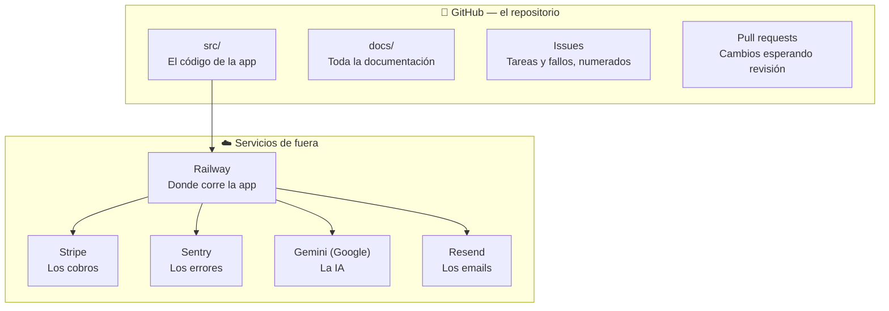
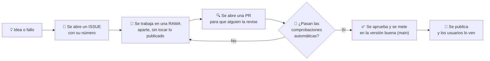

# 6 · Cómo trabajamos

Dónde vive cada cosa, cómo se mueve un cambio y qué se espera de ti cuando
propongas algo.

## Dónde vive cada cosa

Y dentro de `docs/`, cada carpeta tiene un papel:

| Carpeta | Qué contiene | ¿Te interesa? |
|---|---|---|
| `docs/onboarding/` | Esto que estás leyendo | ✅ |
| `docs/02_product/` | Producto, personas, planes | ✅ Mucho |
| `docs/03_features/` | Un documento por funcionalidad, con detalle | ✅ Para consultar |
| `docs/PLAN_DE_NEGOCIO.md` | Mercado, competencia, números | ✅ Mucho |
| `docs/00_system/` | Vocabulario y reglas del sistema | 🔶 El glosario, sí |
| `docs/01_architecture/` | Cómo está montado por dentro | ❌ |
| `docs/04_engineering/` | Convenciones de programación | ❌ |
| `docs/05_operations/` | Qué hacer cuando algo se cae | ❌ |
| `docs/06_decisions/` | Las 22 fichas de decisiones (**ADR**) | 🔶 Útil para entender "por qué está así" |
| `docs/07_ai/` | Cómo trabajan los agentes de IA en el repo | ❌ |

Y en la raíz: **`CONTEXT.md`** es el mapa maestro. Si te pierdes, vuelve ahí.

📓 La documentación está pensada también como **vault de Obsidian** (el
repositorio entero se puede abrir con Obsidian y navegar por los enlaces
`[[así]]`). Si prefieres leer así en vez de en GitHub, es la forma cómoda.

## Cómo se mueve un cambio

Dos reglas que explican mucho de lo que verás:

- **Nunca se toca directamente la versión buena.** Todo pasa por rama y
  revisión. Por eso a veces algo "ya está hecho" pero todavía no se ve: está
  esperando revisión.
- **El robot manda.** Hay comprobaciones automáticas que bloquean un cambio si
  se rompe algo, incluida una que revisa que **no haya textos sin traducir**.

## Qué se espera cuando propongas algo

No hace falta que abras un issue con formato técnico, pero cuanto más de esto
traigas, más rápido se resuelve:

| Si propones… | Trae… |
|---|---|
| Un cambio de texto en la app | La frase **en español y en inglés**, y en qué pantalla está |
| Un cambio visual | Si es para **móvil, escritorio o ambos**, y una captura o referencia |
| Un fallo que has visto | Qué hiciste, qué esperabas, qué pasó, y en qué pantalla y dispositivo |
| Un precio o una cifra pública | De dónde sale el dato y confirmación de que está cerrado |

## Tres cosas que no debes hacer sin preguntar

1. **Publicar precios.** Los de la app son provisionales y hay dos tablas
   distintas circulando ([[docs/onboarding/04_mercado_y_clientes|ver capítulo 4]]).
2. **Decir que cumplimos VERI\*FACTU.** No emitimos facturas; no somos un
   sistema certificado. La frase correcta es que **leemos y verificamos** las
   facturas certificadas que el restaurante recibe.
3. **Usar capturas de las pantallas internas** (`/admin/*`). No son producto.

## El estado actual del proyecto

**Pre-lanzamiento.** No hay clientes de pago todavía; hay una lista de espera y
una cuenta de demostración con datos de ejemplo. Existe una carpeta de
generación de facturas sintéticas que permite crear documentos realistas para
probar sin usar datos de un cliente real — útil si necesitas material para
capturas o vídeos sin comprometer datos de nadie.

Las cosas que el equipo sabe que están a medias están apuntadas y numeradas en
`CONTEXT.md`, en la sección de tareas abiertas. Que algo esté ahí significa que
ya es conocido: no hace falta reportarlo otra vez.

## Si quieres profundizar

- [[CONTEXT|CONTEXT.md]] — el mapa maestro y el estado actual
- `AGENTS.md` — la puerta de entrada de la documentación para el equipo técnico
- `docs/06_decisions/README.md` — el índice de las 22 decisiones de arquitectura
