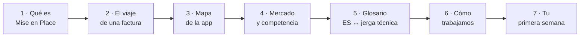

# Onboarding — Bienvenida al equipo

Este pack está escrito para alguien que **no programa**. No hace falta que
entiendas el código: hace falta que entiendas **qué hace el producto, para
quién, y por qué el equipo habla como habla**.

Todo lo demás (el repositorio, las decisiones técnicas, los tests) existe, está
documentado, y está a un clic de aquí — pero es opcional para tu trabajo diario.

## Ruta recomendada (≈ 90 minutos)

| # | Documento | Para qué te sirve | Tiempo |
|---|---|---|---|
| 1 | [[docs/onboarding/01_que_es_mise_en_place\|Qué es Mise en Place]] | El problema, la solución y el negocio en una página | 10 min |
| 2 | [[docs/onboarding/02_viaje_de_una_factura\|El viaje de una factura]] | Cómo funciona el producto por dentro, sin tecnicismos | 15 min |
| 3 | [[docs/onboarding/03_mapa_de_la_app\|Mapa de la app]] | Qué pantalla hace qué, y cómo llamarla | 15 min |
| 4 | [[docs/onboarding/04_mercado_y_clientes\|Mercado y clientes]] | A quién le vendemos, contra quién competimos, por qué ahora | 20 min |
| 5 | [[docs/onboarding/05_glosario\|Glosario]] | Traductor: lo que oyes en una reunión → lo que significa | consulta |
| 6 | [[docs/onboarding/06_como_trabajamos\|Cómo trabajamos]] | Herramientas, dónde vive cada cosa, cómo pedir cambios | 15 min |
| 7 | [[docs/onboarding/07_primera_semana\|Tu primera semana]] | Checklist concreto de arranque | 10 min |

Y cuando termines de leer, tu espacio de trabajo:

| Carpeta | Qué es |
|---|---|
| [[docs/onboarding/marketing/README\|`marketing/`]] | Tu manual de trabajo: estrategia, audiencia, canales, plantillas, decisiones y cómo usar Claude en todo ello. Montado igual que la documentación técnica del proyecto |

## Lo mínimo que hay que retener

Si solo te quedas con cinco frases, que sean estas:

1. **Mise en Place convierte facturas de proveedor en decisiones de compra.**
   El hostelero fotografía una factura; la IA la lee; la app le avisa de que el
   pescado ha subido un 12 %.
2. **El cliente es el restaurante independiente español.** Márgenes del 3–5 %,
   dueño que hace de comprador, contable y jefe de sala a la vez.
3. **La IA lee, pero no decide.** Los importes dudosos los confirma siempre una
   persona antes de guardarse. Es una regla de producto, no un detalle técnico.
4. **Hay una ola regulatoria detrás** (VERI\*FACTU 2027, factura electrónica
   B2B): digitalizar la factura de proveedor pasa de "deseable" a obligatorio.
5. **Estamos pre-lanzamiento.** Hay lista de espera, no todavía clientes de
   pago. Casi todo lo que hagas en marketing e investigación alimenta el
   lanzamiento.

## Convenciones de esta carpeta

- Lenguaje llano en español. Cuando aparece un término técnico inevitable, va
  **en negrita** y está en el [[docs/onboarding/05_glosario|glosario]].
- Cada documento cierra con una sección **"Si quieres profundizar"** que enlaza
  a la documentación técnica del equipo. Es opcional.
- Los diagramas son de tipo *mermaid*: se ven renderizados en Obsidian y en
  GitHub, y como texto en cualquier otro sitio.

## Si quieres profundizar

- [[CONTEXT|CONTEXT.md]] — el mapa maestro de toda la documentación del proyecto
- `docs/02_product/` — definición de producto, personas y planes, en inglés y con
  más detalle
- `docs/02_product/plan_de_negocio.md` — el plan de negocio completo (versión inversores)
