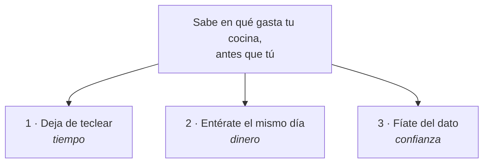

# Mensajes

La estructura de lo que decimos. Un mensaje sin prueba es publicidad; un mensaje
con prueba es un argumento. Por eso cada promesa de aquí lleva su columna de
**prueba** — y las que están vacías son trabajo pendiente, no adorno.

## La promesa central

> **Sabe en qué gasta tu cocina, antes que tú.**

Todo lo demás la sostiene. Si un texto no acaba apuntando ahí, sobra.

## Los tres pilares

### Pilar 1 — Deja de teclear

| | |
|---|---|
| **Qué prometemos** | Una foto y ya está. Ni hoja de cálculo, ni cajón, ni viernes de papeleo |
| **A quién le duele** | Al dueño-chef y a quien lleve la administración |
| **Prueba que tenemos** | El flujo real: foto → lectura → confirmar. Se demuestra en 30 segundos con la cuenta de demostración |
| **Prueba que falta** | 🟡 Un dato propio de cuánto tarda de verdad, medido, no estimado |
| **Frase viva** | «Tres movimientos. Cero hojas de cálculo.» |

### Pilar 2 — Entérate el mismo día

| | |
|---|---|
| **Qué prometemos** | Cuando un proveedor sube un precio, te enteras al recibir la mercancía, no tres meses después |
| **A quién le duele** | Al que negocia con proveedores |
| **Prueba que tenemos** | Las alertas se calculan al confirmar cada factura, no en un proceso nocturno. El umbral por defecto es un 15 % de desviación |
| **Prueba que falta** | 🟡 Un caso real con números: «este restaurante detectó X y ahorró Y» |
| **Frase viva** | «El aceite sube un ocho por ciento un martes cualquiera. Lo descubres tres meses después.» |

### Pilar 3 — Fíate del dato

| | |
|---|---|
| **Qué prometemos** | Si la máquina duda, te lo dice y lo confirmas tú. No se inventa cifras |
| **A quién le duele** | Al que ya probó un escáner y le falló |
| **Prueba que tenemos** | Es una regla de producto real: un importe dudoso **no se puede guardar** sin revisión humana. Los campos van marcados en verde, ámbar y rojo |
| **Prueba que falta** | 🟡 El porcentaje de acierto medido sobre facturas reales |
| **Frase viva** | «Si algo no se entiende, te lo señala para que lo confirmes tú — no inventa.» |

**El pilar 3 es el más infravalorado.** Es donde la competencia falla y donde
tenemos una respuesta de producto de verdad. Merece más espacio del que tiene
hoy en la landing.

## Cómo cambia el mensaje según a quién le hablas

| Audiencia | Lo que le mueve | Por dónde entrar |
|---|---|---|
| **Dueño-chef, un local** | El tiempo y el agobio | El viernes de papeleo. Nada de analítica |
| **Grupo de 2–5 locales** | La comparación entre locales y el descontrol | «Qué local compra más caro» |
| **Administrativo** | Que le quiten trabajo repetitivo | Sin fricción, sin teclear |
| **Gestoría** | Recibir datos limpios y a tiempo | Le ahorramos trabajo, no le quitamos el cliente |
| **Inversor o prensa** | El mercado y el momento regulatorio | Las tres fuerzas: inflación, ley, salto tecnológico |

## Lo que NO decimos

| En vez de… | Di… | Por qué |
|---|---|---|
| «Impulsado por IA» | «Lee tus albaranes, incluso la foto arrugada» | La IA no es el beneficio, es la fontanería |
| «Optimiza tus KPIs» | «Sabe en qué gastas» | El dueño-chef no habla así |
| «Solución integral de gestión» | «Control de lo que compras» | Integral significa caro y complicado |
| «Ahorra hasta un 30 %» | (nada, hasta tener el dato) | Un ahorro inventado es la forma más rápida de perder credibilidad |
| «Cumple con la nueva normativa» | «Preparado para la factura electrónica que vas a recibir» | Ver las [[docs/onboarding/marketing/00_base/02_reglas_inquebrantables|reglas]] |

## El ángulo regulatorio

Merece tratamiento aparte porque tiene fechas y genera búsquedas: VERI\*FACTU
ya tiene fecha firme (2027) para usar facturación certificada; la factura
electrónica B2B está en camino, sin fecha cerrada todavía.

Nuestro papel es la **capa de inteligencia sobre una obligación que llega
igual**. Otros lo venderán como cumplimiento; nosotros, como aprovechamiento:
ya que vas a tener el dato estructurado por ley, úsalo para comprar mejor.

Cuidado con el matiz de siempre: nosotros no emitimos, así que no resolvemos la
parte de VERI\*FACTU que le van a exigir. Confundirlo genera un lead que se
enfada al descubrirlo.

## Relacionado

- [[docs/onboarding/marketing/01_estrategia/posicionamiento|Posicionamiento]]
- [[docs/onboarding/marketing/02_audiencia/objeciones|Objeciones]]
- [[docs/onboarding/marketing/04_produccion/guia_de_estilo|Guía de estilo]]
