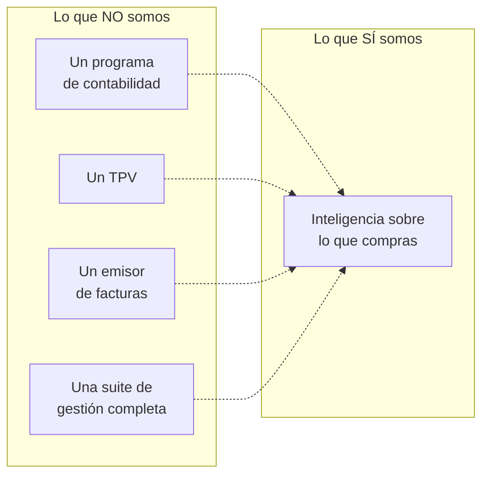

# Posicionamiento

Dónde nos situamos y, sobre todo, dónde **no**. Todo lo demás —mensajes,
canales, contenido— se deriva de aquí. Si cambia esto, cambia todo.

## La frase de posicionamiento

> Para el **dueño-chef de un restaurante independiente en España**, que pierde
> horas y margen porque las facturas de sus proveedores no acaban en ningún
> sitio, **Mise en Place** es la herramienta que convierte cada albarán en
> control de compras. A diferencia de los programas de contabilidad —que solo
> miran la cabecera de la factura para los impuestos— y de las suites de
> hostelería —caras, con comercial e implantación—, Mise en Place baja al precio
> por ingrediente, tiene precio público y da valor con la primera factura.

## Los cuatro ejes

| Eje | Nuestra posición | La alternativa que rechazamos |
|---|---|---|
| **Profundidad del dato** | Bajamos al precio por ingrediente, con conversión de unidades | Quedarse en el total de la factura, que es lo que hace la contabilidad |
| **Modelo de venta** | Precio público, alta sola, sin llamada | Presupuesto a medida y comercial, como toda la categoría |
| **Tiempo hasta el valor** | La primera factura ya dice algo útil | Implantación de semanas antes de ver nada |
| **Origen** | Hecho por alguien que estuvo en la cocina | Producto diseñado desde fuera del sector |

## Contra qué luchamos de verdad

El competidor real no es Haddock. **Es la carpeta de plástico y la hoja de
cálculo.** La mayoría de nuestros clientes potenciales no está evaluando
software: no hace nada.

Consecuencia práctica para el marketing: el mensaje no puede ser «somos mejores
que X». Tiene que ser «esto que haces cada viernes puede dejar de existir». La
comparativa con competidores solo importa en la minoría de casos donde alguien
ya está buscando.

## La ventaja que no se copia

Tres cosas, en orden de solidez:

1. **El origen.** Victor fue chef. «Hecho en una cocina, no en una sala de
   juntas» no es un eslogan, es un hecho, y ningún competidor financiado puede
   decirlo.
2. **El grafo de precios.** Cada factura procesada engorda un histórico de
   precios por ingrediente, proveedor y zona. Con mil restaurantes dentro, eso
   es el mejor índice de precios de alimentación mayorista de España. Es una
   ventaja que crece sola.
3. **El coste de cambio.** Cuando el histórico de compras de tres años vive
   dentro, irse duele.

La extracción en sí **no** es ventaja: leer facturas con IA se ha vuelto
barato y accesible para cualquiera. No construyas el mensaje sobre eso.

## La brecha entre lo que somos y lo que se percibe

Un aviso para el trabajo de investigación: el posicionamiento de arriba es el
que hemos decidido, no el que el mercado percibe. Nadie lo ha comprobado con
hosteleros reales. Confirmarlo —o desmontarlo— es de lo más valioso que se
puede hacer ahora mismo.

Preguntas que lo pondrían a prueba:

- ¿El dueño-chef se identifica con «defender el margen», o eso suena a
  consultor?
- ¿Entiende «control operativo para cocinas profesionales», o le suena grande
  para su bar de menú?
- ¿Le pesa más el tiempo perdido o el dinero perdido? Todo el mensaje está
  construido sobre el segundo.

## Relacionado

- [[docs/onboarding/marketing/01_estrategia/mensajes|Mensajes]] — cómo se traduce esto en frases
- [[docs/onboarding/marketing/01_estrategia/competencia|Competencia]]
- [[docs/onboarding/04_mercado_y_clientes|Capítulo 4 del onboarding]]
