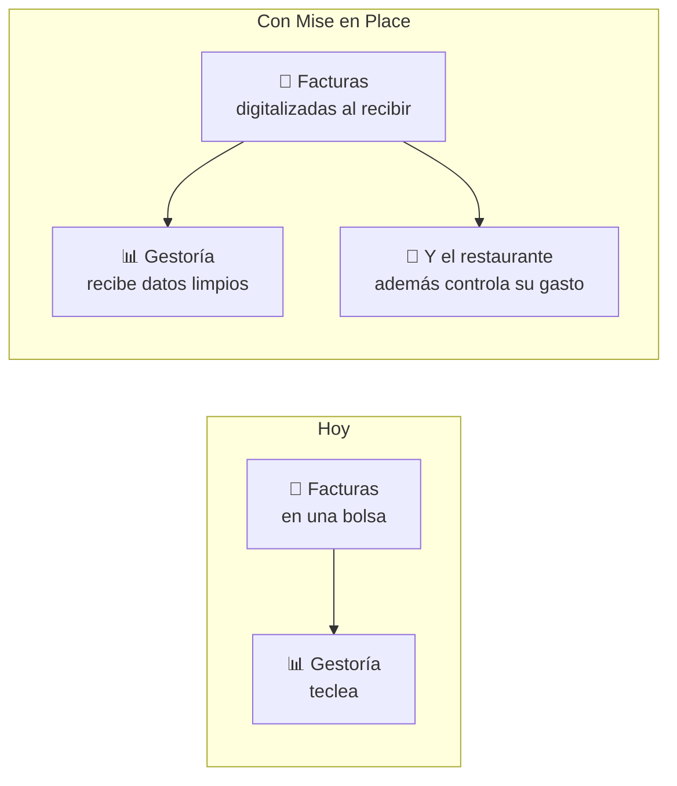

# Canal: gestorías

🟡 **Estado: hipótesis del plan de negocio, sin validar.** Nadie ha hablado
todavía con un despacho. Es el canal con más potencial y más incógnitas.

## La idea

La factura del restaurante **ya viaja cada mes a su gestoría** para los
impuestos. Ese camino existe, es mensual y es obligatorio. Nosotros nos ponemos
aguas arriba: el restaurante digitaliza al recibir, y la gestoría recibe datos
limpios en vez de una bolsa de papeles.

Números que lo hacen atractivo: ~70.000 despachos en España, solo un 10 %
digitalizados, y cada uno con decenas o cientos de clientes. Un despacho
convencido son muchos restaurantes de golpe.

Que el modelo funciona lo demuestran los programas de partners de Quipu y
Holded, que llevan años captando por ahí.

## Por qué el gestor podría querer esto

- Menos horas de tecleo, que es trabajo que no puede facturar caro.
- Menos persecución del cliente en marzo pidiendo papeles.
- Un argumento para sus clientes de cara a VERI\*FACTU en 2027 y la e-factura
  B2B después, sin fecha firme todavía.
- Un servicio nuevo que ofrecer sin desarrollarlo él.

## Por qué podría no querer

Hay que anticiparlo, no descubrirlo en la reunión:

- **Miedo a la desintermediación.** Si huele que le quitamos el cliente, se
  acabó. Desactívalo en la primera frase.
- **Parte de sus ingresos es precisamente ese tecleo.** Ahorrarle horas puede
  ser quitarle facturación. Hay que entender su modelo antes de prometer nada.
- **Ya tiene un acuerdo** con Holded, Quipu o similar.
- **Nos falta lo que necesita**: hoy exportamos a Excel, no a los formatos
  contables que usan (a3, Contasol). Eso es producto, no marketing.

## Qué hay que averiguar antes de invertir aquí

Cinco preguntas. Con cinco conversaciones habría respuestas:

1. ¿Cómo le llegan hoy las facturas de un cliente de hostelería, y qué hace con
   ellas?
2. ¿Cuánto tiempo se le va, y lo factura o lo absorbe?
3. ¿Qué formato necesitaría recibir para que le ahorrara trabajo de verdad?
4. ¿Recomienda software a sus clientes? ¿Con qué criterio? ¿Cobra por ello?
5. ¿Qué le parecería que su cliente digitalizara antes de mandárselo?

## Cómo se hablaría con ellos

El mensaje es **para el despacho**, no para el restaurante:

> Tus clientes de hostelería te mandan una bolsa de papeles. Con Mise en Place te
> llegan ya digitalizados y ordenados, y ellos además ven en qué gastan. Tú
> sigues llevando su contabilidad; nosotros le quitamos el papel de en medio.

Y lo que **no** se dice jamás: nada que suene a llevar la contabilidad, hacer
impuestos o sustituir su trabajo.

## Estado y decisión pendiente

Antes de meter horas aquí hay que saber **si este canal se explora ya o está
aparcado** hasta después del lanzamiento. Es una de las preguntas abiertas del
[[docs/onboarding/marketing/00_base/00_mapa|mapa]].

Argumento a favor de explorarlo ya, aunque sea despacio: cinco conversaciones
cuestan una tarde y pueden cambiar la hoja de ruta del producto (por ejemplo,
priorizando la exportación contable). Es investigación barata con impacto alto.

## Relacionado

- [[docs/onboarding/marketing/02_audiencia/segmentos_y_personas|Segmentos y personas]]
- `docs/02_product/plan_de_negocio.md` — el canal gestorías en el plan original
