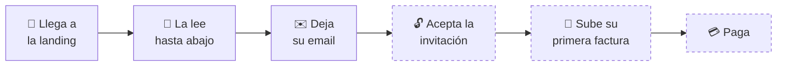

# Medición

Qué mirar y qué ignorar. 🟡 **Antes de nada hay que averiguar qué analítica está
instalada en la landing**, si es que hay alguna. Sin eso, todo lo demás es
teoría.

## La única métrica que importa ahora

**Altas en la lista de espera.** Somos pre-lanzamiento: no hay ingresos, ni
retención, ni ciclo de vida. Todo lo demás es un medio para esto.

Y por debajo, una que cuenta aún más aunque no salga en ningún panel:
**conversaciones con hosteleros reales.** Diez conversaciones valen más ahora
mismo que mil visitas.

## El embudo, hoy

Los tres últimos pasos todavía no ocurren. Están dibujados para recordar que la
alta no es la meta: es el principio.

## Qué mirar en cada paso

| Paso | Qué mirar | ¿Se puede hoy? |
|---|---|---|
| Llega | Visitas y de dónde vienen | ❓ depende de la analítica |
| Lee | Hasta dónde baja, cuánto se queda | ❓ |
| Se apunta | **Altas, y porcentaje sobre visitas** | ✅ las altas se guardan en la base de datos |
| Móvil / escritorio | El porcentaje de alta de cada uno | ❓ |
| Idioma | Cuántos en español y cuántos en inglés | ❓ |
| Acepta | Cuántos entran cuando se les invita | 🔜 cuando abra la primera tanda |
| Primera factura | Cuántos llegan a confirmar una | 🔜 |

Ese último es el que de verdad predice si el producto funciona: **la primera
factura confirmada es el momento en que alguien entiende para qué sirve esto.**

## Lo que NO hay que perseguir

- **Seguidores.** No venden nada aquí.
- **Impresiones y alcance.** Con este tamaño de tráfico, ruido.
- **Significación estadística.** No la vas a tener. Con números pequeños se
  decide con criterio y se anota la duda.
- **Comparar semanas sueltas.** En hostelería el calendario manda: agosto,
  Navidad y la temporada distorsionan todo.

## Qué revisar y cada cuánto

**Cada semana** (cinco minutos): altas nuevas, de dónde vinieron, y si algo se
ha roto.

**Cada mes**: el embudo entero, qué contenido trajo gente, qué se aprendió de
las conversaciones y qué se prueba el mes que viene.

**Cuando abra la primera tanda**: cambia todo. Empieza a medirse activación
—cuántos llegan a confirmar su primera factura— y esa pasa a ser la métrica
principal.

## Trabajo pendiente

- [ ] Averiguar qué analítica hay instalada. **Bloquea todo lo demás**
- [ ] Si no hay: decidir cuál, con criterio de privacidad (el público es
      europeo y prometemos cuidado con los datos)
- [ ] Un sitio único donde se apunte el número de altas por semana, aunque sea
      una hoja de cálculo
- [ ] Definir qué cuenta como «alta buena»: un email de un hostelero real no es
      lo mismo que uno de un curioso del sector

## Relacionado

- [[docs/onboarding/marketing/03_canales/landing_waitlist|La landing]]
- [[docs/onboarding/marketing/04_produccion/plantillas|Plantillas]] — cierre de experimento
- `docs/02_product/revenue_metrics.md` — cómo mide el equipo los ingresos, para cuando los haya
