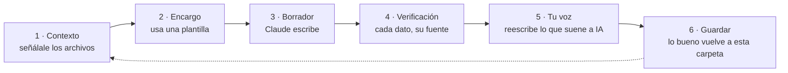

# Trabajar con Claude aquí

El equipo técnico tiene un ciclo de trabajo con IA documentado. Este es el
equivalente para marketing, adaptado a que tu producto no es código sino texto,
investigación y criterio.

## El ciclo

El paso 4 es innegociable y el 6 es el que casi todo el mundo se salta. Si lo
bueno no vuelve a la carpeta, cada conversación empieza de cero para siempre.

## 1. Dale contexto, no lo resumas tú

El error más caro es explicarle el producto de memoria en cada conversación.
Está todo escrito: señálale los archivos.

Arranque recomendado para cualquier conversación de marketing:

> Trabajo en marketing de Mise en Place. Antes de nada lee
> `docs/onboarding/marketing/README.md`,
> `docs/onboarding/marketing/00_base/02_reglas_inquebrantables.md` y
> `docs/onboarding/marketing/04_produccion/guia_de_estilo.md`.
> Después te digo qué necesito.

Si además la tarea toca un canal, añade el archivo de ese canal. Y si toca datos
de mercado, `docs/02_product/plan_de_negocio.md`.

Si es una sesión de continuidad (no la primera), añade también
[[docs/onboarding/marketing/07_con_claude/bitacora_de_sesiones|la bitácora de
sesiones]] — ahí está el resumen de qué se ha hablado antes, qué se decidió y
qué queda pendiente.

## 2. Encarga con una plantilla, no con una frase

«Escríbeme un post sobre food cost» da un texto genérico que podría ser de
cualquiera. Las [[docs/onboarding/marketing/04_produccion/plantillas|plantillas]]
existen para eso: rellenas el encargo y se lo pasas entero.

Cuanto más concreto el «qué NO puede decir», mejor sale el borrador.

## 3. Pídele opciones, no una versión

Para titulares y frases cortas, pide cinco versiones con enfoques distintos y
elige. Para textos largos, pide primero el esquema, apruébalo, y luego el
desarrollo. Corregir un esquema cuesta un minuto; corregir tres páginas, una
tarde.

## 4. Verificación: el paso que no se salta

**Claude escribe cifras falsas con total aplomo.** No es un fallo ocasional: es
la forma en que funciona. Un porcentaje inventado tiene exactamente el mismo
aspecto que uno real.

Antes de que nada salga:

| Tipo de afirmación | Cómo se verifica |
|---|---|
| Una cifra de mercado | Contra `docs/02_product/plan_de_negocio.md`, que cita sus fuentes |
| Una fecha legal | Contra el plan de negocio o el BOE. **Nunca de memoria** |
| Algo que hace el producto | Contra la app o `docs/02_product/` |
| Algo sobre un competidor | Contra su web o una reseña que puedas enlazar |
| Un precio | Preguntando. Siempre |

Truco útil: pídele que **marque explícitamente lo que no ha podido verificar**.

> Marca con ⚠️ cualquier dato, fecha o cifra que no puedas respaldar con una
> fuente concreta, en vez de darlo por bueno.

Y desconfía especialmente de lo que suena redondo: «el 73 % de los restaurantes»
es justo la clase de frase que se inventa sola.

## 5. Quítale el acento de IA

Un borrador de Claude tiene marcas reconocibles. En textos en español, busca y
elimina:

- Tríos de adjetivos donde bastaría uno
- «En un mundo donde…», «No se trata solo de…, sino de…»
- Frases que empiezan por «Descubre», «Imagina», «Transforma»
- Simetrías perfectas: tres bloques de tres frases cada uno
- Entusiasmo sin motivo y exclamaciones

La prueba de la [[docs/onboarding/marketing/04_produccion/guia_de_estilo|guía de
estilo]]: léelo en voz alta imaginando que se lo dices a un cocinero a las once
de la noche.

## 6. Devuelve lo bueno a la carpeta

Si en una conversación sale una objeción nueva, una frase que funciona o un
hallazgo de competencia, **no se queda en el chat**. Va al archivo que le
corresponda. Es lo que hace que la carpeta valga más cada mes en vez de
envejecer.

Puedes pedírselo directamente:

> Esto ha salido bien. Añádelo a
> `docs/onboarding/marketing/02_audiencia/objeciones.md` respetando el formato
> del archivo, sin reescribir el resto.

## Lo que Claude hace bien y lo que no

| Muy bien | Mal |
|---|---|
| Estructurar y ordenar ideas sueltas | Inventar datos con seguridad total |
| Cinco variantes de un titular | Saber qué hace el producto sin que se lo digas |
| Traducir manteniendo el tono | Juzgar si algo es legalmente arriesgado |
| Resumir documentos largos | Tener criterio sobre el sector |
| Encontrar el hilo común en diez entrevistas | Saber qué está construido y qué es promesa |

Resumen: **es un redactor rapidísimo sin criterio propio y con tendencia a
rellenar huecos.** El criterio lo pones tú, y por eso el paso 4 existe.

## Relacionado

- [[docs/onboarding/marketing/07_con_claude/bitacora_de_sesiones|Bitácora de sesiones]]
- [[docs/onboarding/marketing/07_con_claude/biblioteca_de_prompts|Biblioteca de prompts]]
- [[docs/onboarding/marketing/04_produccion/plantillas|Plantillas]]
- [[docs/onboarding/marketing/00_base/02_reglas_inquebrantables|Reglas inquebrantables]]
