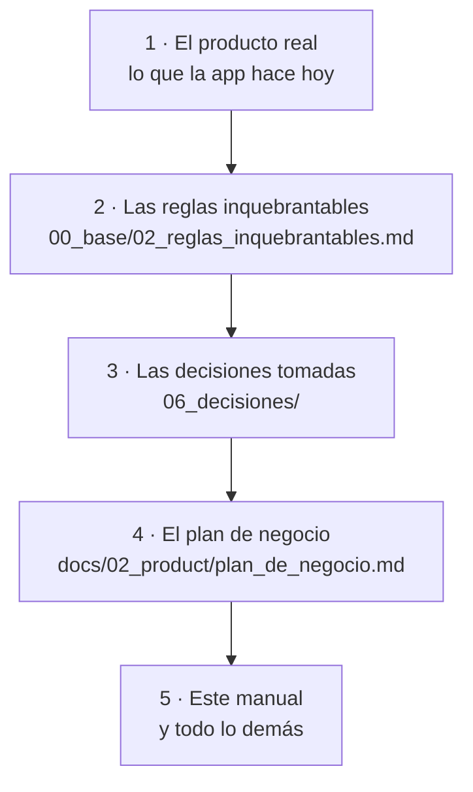

# Marketing — Manual de trabajo

Este es tu espacio de trabajo. Está montado igual que la documentación técnica
del proyecto (`docs/`, con carpetas numeradas y un punto de entrada), pero con
contenido de marketing y en lenguaje llano.

Sirve para dos cosas a la vez:

1. **Que tú sepas dónde está cada cosa** y dónde escribir lo nuevo.
2. **Que Claude pueda trabajar contigo** sin que tengas que reexplicarle el
   producto en cada conversación. Le señalas un archivo de esta carpeta y ya
   tiene el contexto.

## Cómo está organizado

| Carpeta | Qué contiene | Cuándo la abres |
|---|---|---|
| `00_base/` | El mapa, el vocabulario de marca y las reglas que no se rompen | Antes de escribir nada hacia fuera |
| `01_estrategia/` | Posicionamiento, mensajes y competencia | Al decidir *qué* decimos |
| `02_audiencia/` | Segmentos, personas y objeciones | Al decidir *a quién* y cómo rebatirle |
| `03_canales/` | Un archivo por canal: landing, contenido, gestorías, email | Al ejecutar en un canal concreto |
| `04_produccion/` | Guía de estilo y plantillas de encargo | Al redactar o al pedirle algo a Claude |
| `05_medicion/` | Qué medimos y cómo se lee | Al cerrar o evaluar algo |
| `06_decisiones/` | Las decisiones de marketing ya tomadas, con su porqué | Cuando quieras cambiar algo que ya estaba decidido |
| `07_con_claude/` | Cómo trabajar con Claude aquí, y la biblioteca de prompts | Cada vez que abras una conversación |
| `08_incidencias/` | Cosas detectadas que hay que revisar antes de publicar, y que aún no son una decisión | Cuando algo no cuadra entre lo que se dice y lo que el producto o una fuente externa confirman |

## Dónde está la verdad

Cuando dos documentos se contradigan, este es el orden. **No lo resuelvas en
silencio: dilo.**

Traducción práctica: si el plan de negocio dice una cosa y la app hace otra,
**manda la app**, y hay que apuntar la diferencia. Es la misma regla que sigue
el equipo técnico.

## Antes de que nada salga fuera

Tres comprobaciones, siempre, sin excepción:

- [ ] ¿Cumple las [[docs/onboarding/marketing/00_base/02_reglas_inquebrantables|reglas inquebrantables]]?
- [ ] ¿Cada dato tiene una fuente que puedes señalar?
- [ ] ¿Está en **español e inglés** si va a una superficie bilingüe?

## Cómo se usa con Claude

La forma corta: abre una conversación, dile qué carpeta es relevante, y pide.
La forma buena está en
[[docs/onboarding/marketing/07_con_claude/flujo_de_trabajo|07_con_claude/flujo_de_trabajo]],
con la biblioteca de prompts al lado.

Regla de oro con Claude en marketing: **es excelente redactando y estructurando,
y es capaz de inventarse un dato con total aplomo.** Todo lo que sea una cifra,
una fecha legal o una afirmación sobre un competidor se verifica contra una
fuente antes de publicarse. El protocolo está en el mismo archivo.

## Cómo se amplía esta carpeta

Igual que la documentación técnica:

- Un archivo nuevo lleva frontmatter (`tags: [mep, onboarding, marketing]` +
  `related: "[[CONTEXT]]"`) y se añade a la tabla de arriba.
- Si lo que cambia es **el porqué** de algo ya decidido, no edites el documento
  a la brava: crea una decisión en `06_decisiones/` con la plantilla.
- Si algo aquí ya no es verdad, arréglalo. Un documento desactualizado hace más
  daño que uno que no existe.

## Relacionado

- [[docs/onboarding/README|El pack de onboarding]] — empieza por ahí si aún no lo has leído
- [[docs/onboarding/04_mercado_y_clientes|Capítulo 4: mercado y clientes]] — el resumen del que sale casi todo lo de aquí
- `docs/02_product/plan_de_negocio.md` — la fuente con las citas y las cifras originales
