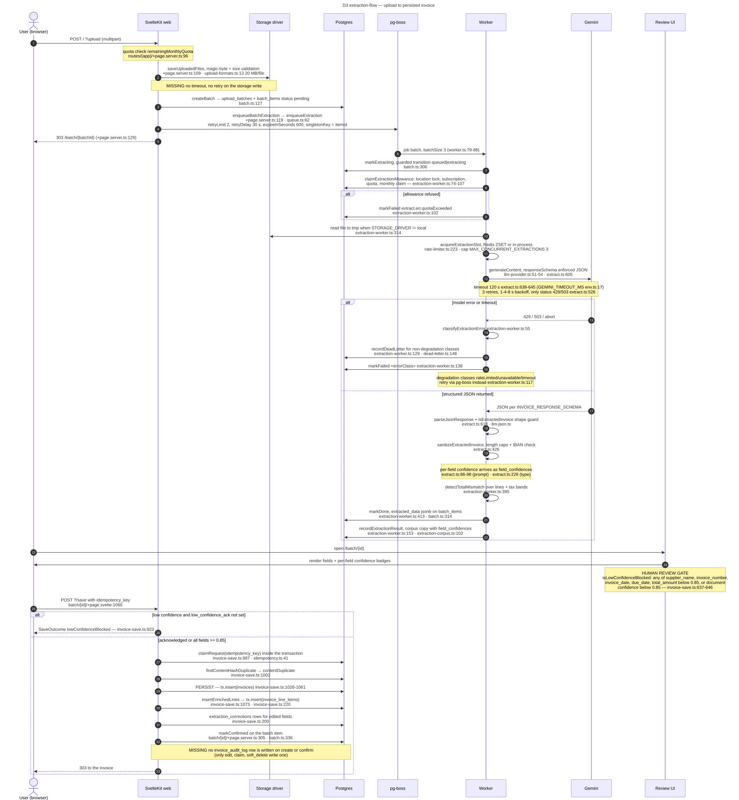

# System design audit — mise-en-place-sk

Read-only audit. Every claim below cites `path:line` in this repository, or is marked UNKNOWN.
Nothing is inferred from framework convention. Production numbers come from the Railway API for
project `mise_en_place_sk-PF`, environment `production`, 7-day window, retrieved 2026-09-07.

Scope of the tree: 1101 tracked files (`git ls-files`), 28 `+server.ts` endpoints, 51
`+page.server.ts` route modules, 77 migrations in `drizzle/meta/_journal.json`, 281 `*.test.ts`.
No `.env` and no key material is tracked — `git ls-files` returns only `.env.example`.

---

## 1. Constraints

### 1.1 Measured in production (Railway API, 7 days to 2026-09-07)

| Constraint | Value | Meaning for the business |
|---|---|---|
| Web HTTP requests | 33,874 total → **0.056 rps average** | The system is pre-scale; every capacity argument below is about headroom, not relief. |
| Status mix | 21,268 2xx · 12,537 3xx · 69 4xx · **0 5xx** | No server-side failures reached a user in a week; the redirect share (37%) is the auth/locale redirect chain in `hooks.server.ts:130,139,199,216`. |
| Web latency p50 | 6–11 ms per daily bucket | Page loads are not the bottleneck. |
| Web latency p95 | 30–140 ms (worst bucket 140 ms) | Well inside the 8 s load-block timeout at `load-guard.ts:5`. |
| Web latency p99 | 43–566 ms | The 566 ms tail is one bucket; nothing in the repo records which route it is. |
| Web CPU | avg 0.0012 vCPU of an 8 vCPU limit (0.015%), max 0.133 | One replica is over-provisioned by roughly three orders of magnitude. |
| Web memory | avg 0.122 GB of 8 GB, max 0.411 GB | No memory pressure; the 128 MB body limit at `Dockerfile:37` is the real upload ceiling, not RAM. |
| Worker CPU | avg 0.0053 vCPU of 8 (0.066%), max 0.125 | The worker is idle-dominated: it waits on Gemini, it does not compute. |
| Worker memory | avg 0.095 GB, max 0.436 GB | The worker reads whole files into a Buffer before extraction (`extraction-worker.ts:314-317`); what drove the 0.436 GB peak is not recorded — UNKNOWN. |
| Postgres CPU | avg 0.0139 vCPU of 8 (0.17%), max 0.049 | Nothing justifies a read replica today. |
| Postgres memory | avg 0.128 GB of 8 GB | — |
| Postgres disk | 0.247 GB, growing 0.238 → 0.247 GB over 7 days (~1.2 MB/day) | At this rate the DB is years from any storage decision. |

### 1.2 Declared in the repo (defaults, not measurements)

| Constraint | Value | Evidence | Meaning |
|---|---|---|---|
| Global API rate limit | 300 req / 60 s per user or IP | `hooks.server.ts:33,152-158` | A single tenant cannot starve the others through the API surface. |
| Rate-limit exemptions | `/api/health`, `/api/stripe-webhook`, `/api/whatsapp/webhook` | `hooks.server.ts:34` | Webhook providers are never throttled — correct, but those three paths have no ceiling at all. |
| Chat rate limit | 20 rpm | `env.ts:18` | Caps LLM spend per tenant on the assistant. |
| Health rate limit | 60 rpm per IP | `env.ts:48` | — |
| Max concurrent extractions | 3, process- or Redis-wide | `env.ts:19`, `rate-limiter.ts:223` | The hard throughput ceiling of the whole product: 3 invoices in flight. |
| Gemini call timeout | 120,000 ms | `env.ts:17`, `extract.ts:638-645` | Worst-case a single invoice occupies one of the 3 slots for 2 minutes. |
| Gemini retries | 3, backoff 1 s / 2 s / 4 s, only on HTTP 429 and 503 | `extract.ts:526-541` | A 500 from Gemini is not retried in-process; it falls to the pg-boss retry. |
| PDF text-extraction timeout | 15,000 ms | `extract.ts:484,490` | — |
| DB statement timeout | 15,000 ms | `db.ts:10,30` | A runaway query cannot hold a connection past 15 s. |
| DB connect timeout | 10 s | `db.ts:9` | — |
| DB pool | max 20, idle 30 s, max lifetime 600 s | `db.ts:11-13` | 20 is the app's concurrency ceiling against Postgres. |
| Membership lookup timeout | 5,000 ms | `hooks.server.ts:32,73` | On timeout the request degrades to "no memberships" (`hooks.server.ts:85-89`) rather than erroring. |
| Page load block timeout | 8,000 ms | `load-guard.ts:5,18` | Slow blocks render a fallback instead of a 500. |
| Session lifetime | 30 days, JWT | `auth.ts:15,26` | — |
| Upload size | 20 MB per file, 100 MB per batch, min 1 KB | `upload-formats.ts:13,15,17` | — |
| HTTP body limit | 128 MB | `Dockerfile:37` | Deliberately above the 100 MB batch total. |
| Export row cap | 10,000 rows | `env.ts:20`, `invoices/export/download/+server.ts:91` | Protects the web process from an unbounded CSV build. |
| Extraction stall warn / timeout | 120,000 ms / 900,000 ms | `env.ts:22-23`, `batch.ts:96-103,283-298` | An item stuck longer than 15 min is reaped to `failed`. |
| Worker heartbeat / stale | 30 s / 120 s | `env.ts:24-25` | A dead worker is visible on `/api/health` within 2 minutes. |
| Replicas | web 1, worker 1 | `railway.json:10`, `railway.worker.json:10` | Single instance each; the in-process semaphore and rate limiter assume it (`rate-limiter.ts:33-37`). |

### 1.3 UNKNOWN — not measured anywhere in the repo

- Per-endpoint RPS and latency. The Railway numbers are service-wide; no route-level metric is emitted.
  *To measure:* record `event.route.id` + duration in `appHandle` (`hooks.server.ts:274`) and export it.
- Extraction throughput and end-to-end latency (upload → `done`). `batch_items.queued_at` and
  `updated_at` exist (`schema.ts:471,477`) but nothing aggregates them.
- `extract-invoice` queue depth over time. `/api/health` computes it once per call
  (`api/health/+server.ts:50-56`); it is never sampled or stored.
- Gemini call latency and token cost per invoice. `llm_usage_log` stores tokens and cost per call
  (`schema.ts:376-387`) but no duration column.
- Object-storage read/write latency (`storage.ts:56-67`). No instrumentation.
- Payload-size distribution of uploaded documents. `statSize` is display-only and local-driver-only
  (`batch/[id]/+page.server.ts:43-51`).
- Tenant count, invoices per tenant, rows per table. *To measure:* a counts query per
  `tenantDataMap` entry (`tenant-data-map.ts:23`).

---

## 2. Data model

Schema: `src/lib/server/schema.ts`, 49 tables. Tenant-scoping column: `restaurant_id`
(`ADR-001`, app-level scoping; `tenant.ts:4-13` is the only sanctioned scoping helper, enforced in CI
by `pnpm lint:tenant-scope` at `.github/workflows/ci.yml:71`).

### 2.1 Entity table (core path)

| Table | PK | Tenant col | Key FKs | Indexes declared | Line |
|---|---|---|---|---|---|
| `restaurants` | `id` uuid | *is* the tenant | `parent_id` → self CASCADE | `restaurants_parent_idx(parent_id)` | `schema.ts:7` |
| `user_restaurants` | `(user_id, restaurant_id)` | `restaurant_id` | `restaurant_id` → restaurants CASCADE; **`user_id` has no FK** | PK only | `schema.ts:27` |
| `users` | `id` uuid | **none** | — | `email` unique | `schema.ts:207` |
| `accounts` | `(provider, provider_account_id)` | **none** | `user_id` → users CASCADE | PK only | `schema.ts:227` |
| `sessions` | `session_token` | **none** | `user_id` → users CASCADE | PK only | `schema.ts:243` |
| `suppliers` | `id` serial | `restaurant_id` | → restaurants CASCADE | `uq(rid, lower(name))`, partial `uq(rid, normalized_cif)` | `schema.ts:36` |
| `supplier_aliases` | `id` serial | `restaurant_id` | `supplier_id` CASCADE | `uq(rid, normalized_name)`, `idx(rid, supplier_id)` | `schema.ts:58` |
| `invoices` | `id` serial | `restaurant_id` | `supplier_id` (no ON DELETE), `linked_invoice_id` SET NULL | 8 indexes incl. partial `uq(rid, content_hash)`, `uq(rid, supplier_id, invoice_number)` | `schema.ts:70` |
| `invoice_line_items` | `id` serial | `restaurant_id` | `invoice_id` CASCADE, `product_id` SET NULL | `idx(invoice_id)`, `idx(rid, description)`, partial `idx(rid, product_id)` | `schema.ts:133` |
| `products` | `id` serial | `restaurant_id` | → restaurants CASCADE | `uq(rid, name_key)` | `schema.ts:158` |
| `invoice_audit_log` | `id` serial | `restaurant_id` | `invoice_id` is a bare `integer`, **no FK** | `idx(rid)`, `idx(invoice_id)` | `schema.ts:257` |
| `upload_batches` | `id` uuid | `restaurant_id` | → restaurants CASCADE | **none** | `schema.ts:453` |
| `batch_items` | `id` uuid | `restaurant_id` | `batch_id` CASCADE, `restaurant_id` CASCADE | `idx(batch_id)`, `idx(updated_at)`, `idx(queued_at)`, partial `uq(job_code)`, `idx(source_ref)` | `schema.ts:459` |
| `extraction_results` | `id` uuid | `restaurant_id` | `batch_item_id` SET NULL | `idx(rid, created_at)`, `idx(rid, file_key)`, `idx(prompt_version, created_at)`, `idx(batch_item_id)` | `schema.ts:487` |
| `extraction_corrections` | `id` serial | `restaurant_id` | `invoice_id`, `supplier_id` | **none** | `schema.ts:342` |
| `dead_letter_queue` | `id` serial | `restaurant_id` nullable | → restaurants CASCADE | 4 indexes incl. `idx(queue, source_id, error_class, status)` | `schema.ts:642` |
| `subscriptions` | `id` serial | `restaurant_id` unique | → restaurants CASCADE | uniques on Stripe ids | `schema.ts:582` |

### 2.2 Findings

- **Unindexed FK — `batch_items.restaurant_id`** (`schema.ts:462`, index list `schema.ts:478-485`): every tenant-scoped read of the upload queue scans by an unindexed column. Business: batch pages slow linearly with total upload volume across *all* tenants, not just the caller's.
- **Unindexed FK — `upload_batches.restaurant_id`** (`schema.ts:455`): same shape, no index at all on the table.
- **Unindexed FK — `extraction_corrections.restaurant_id`, `.invoice_id`, `.supplier_id`** (`schema.ts:344-346`): the table has no index whatsoever; it is the training corpus for prompt improvement (`extraction-improve.ts` via `alerts.ts:1408`), so it only grows.
- **Unindexed FK — `chat_sessions.restaurant_id`** (`schema.ts:357`): no index declared on the table.
- **Unindexed FK — `accounts.user_id`, `sessions.user_id`** (`schema.ts:228,245`): Auth.js adapter tables; a user delete cascades via a sequential scan.
- **Unindexed FK — `supplier_metrics.restaurant_id`** (`schema.ts:293`): only `supplier_id` is unique-indexed.
- **Unindexed FK — `idempotency_keys.restaurant_id`** (`schema.ts:424`): the sweep is by `claimed_at` (`idempotency.ts:55`), so this only bites tenant deletion.
- **Partially indexed FK — `invoices.supplier_id`** (`schema.ts:73`): covered only by `uq(rid, supplier_id, invoice_number) WHERE invoice_number IS NOT NULL` (`schema.ts:111-113`). Albaranes without a number are outside the index; supplier-detail pages scan for them.
- **Partially indexed FK — `mrr_snapshots.restaurant_id`** (`schema.ts:608`): leading column of the unique index is `month` (`schema.ts:616`); the `(rid, month)` index is partial on `mrr_cents > 0` (`schema.ts:618`).
- **`user_restaurants.user_id` has no foreign key to `users`** (`schema.ts:28`, versus `accounts.user_id` at `schema.ts:228` which does). The membership table — the one that decides which tenant a request may read — is not referentially tied to the identity table. Business: a deleted user can leave an orphan membership row; nothing in the schema prevents it.
- **`user_restaurants` is absent from the tenant data map** (`tenant-data-map.ts:23-61` lists 34 tables, not this one) **and from every RLS migration** (`grep 'ENABLE ROW LEVEL SECURITY' drizzle/*.sql` yields 31 tables, none of them this one). Business: the authorization table itself has no database-level tenant guard.
- **RLS coverage gap — `extraction_results`, `supplier_aliases`, `categories`**: all three are declared tenant-owned (`tenant-data-map.ts:36,43,60`) but no migration enables RLS on them. Business: once `DATABASE_URL` is moved to the scoped `mep_runtime` role (`db-role.ts:49` calls the cutover "pending (#464)"), these three tables keep the app-level guard only.
- **RLS is inert today by design**: migration `drizzle/0055_rls_tenant_isolation.sql:6-14` states the policies do nothing for the table-owning role that `DATABASE_URL` currently uses. Business: tenant isolation rests entirely on `forTenant()` plus the CI lint at `.github/workflows/ci.yml:71-75`.
- **Audit trail is incomplete**: `invoice_audit_log` is written for `edit` (`invoice/[id]/edit/+page.server.ts:94`), `claim` (`invoice/[id]/+page.server.ts:277`) and `soft_delete` (`invoice/[id]/+page.server.ts:307`, `invoices/+page.server.ts:220,254`). Invoice **creation** (`invoice-save.ts:1026`) and **confirmation** (`batch/[id]/+page.server.ts:305`) write no audit row. Business: for a Spanish accounting product, "who first entered this invoice and from which document" is not answerable from the database.
- **`invoice_audit_log.invoice_id` is not a foreign key** (`schema.ts:260`) and `user_id` is `text` while `users.id` is `uuid` (`schema.ts:262` vs `schema.ts:208`). Same in `user_consents.user_id` (`schema.ts:574`). Business: audit rows can point at nothing and cannot be joined type-safely.
- **Media is not stored in-row** — files go to disk or an S3 bucket keyed by `file_key` (`storage.ts:13,56`, `schema.ts:464`). Good. But **the extracted payload is**: `batch_items.extracted_data` (`schema.ts:467`) and `extraction_results.extracted_data` (`schema.ts:498`) hold the full LLM JSON, and `whatsapp_session.data` (`schema.ts:525`) holds the whole Baileys credential blob in one row.
- **Soft delete exists only on `invoices`** (`deleted_at`, `schema.ts:96`, partial index `schema.ts:117`). Line items are hard-cascaded (`schema.ts:136`). Business: restoring a soft-deleted invoice cannot restore its lines.
- **Tables with no tenant column** (legitimately global, listed for completeness): `users`, `accounts`, `sessions`, `verification_tokens`, `user_consents`, `waitlist`, `funnel_events`, `app_flags`, `acquisition_costs`, `revenue_assumptions`, `prompt_change_proposals`, `whatsapp_session`, `whatsapp_account_events`, `worker_heartbeats` (`schema.ts:207,227,243,249,572,431,444,599,622,635,511,523,540,676`).

---

## 3. API contract

Guard chain, in order, for every request: `Sentry.sentryHandle()` → Auth.js `handle` → `appHandle` →
`entitlementHandle` (`hooks.server.ts:320`). `appHandle` runs, in order: bypass for `/_app/` and PWA
assets (`hooks.server.ts:142-145,277`), locale, session read (`:283`), **global rate limit** (`:294`),
membership + access flags (`:297`), Sentry context (`:299`), admin redirect (`:301`), access gate
(`:303`), auth gate (`:306`), beta feature flag (`:309`), then the tenant DB context (`:315`).

**The auth guard runs before the handler, not inside it.** Consequence: `+server.ts` files use
`locals.user!` and `locals.restaurantId!` non-null assertions (e.g. `api/notifications/+server.ts:9,12`)
that are only sound because `enforceAuth` (`hooks.server.ts:128`) and `enforceTenant`
(`hooks.server.ts:116`) already rejected the request.

### 3.1 Endpoint table

| Method | Path | Auth layer(s) | Validation | Pagination | Idempotency | Error shape |
|---|---|---|---|---|---|---|
| GET | `/api/health` | public; detail behind `isAdminUser` or `x-health-token` timing-safe compare (`api/health/+server.ts:27-33,123`) | none needed | n/a | n/a | `{status}` / `{error}` |
| POST | `/api/stripe-webhook` | HMAC signature (`api/stripe-webhook/+server.ts:10`); rate-limit exempt (`hooks.server.ts:34`) | Stripe SDK constructEvent | n/a | `idempotency_keys` scope `stripe-webhook` (`billing.ts:680`) | `{error}` |
| GET/POST | `/api/whatsapp/webhook` | HMAC sha256 timing-safe (`webhook/+server.ts:13-28`); **falls open outside production when `WHATSAPP_APP_SECRET` is unset** (`:19-20`) | JSON parse only | n/a | `idempotency_keys` scope `whatsapp` (`message-handler.ts:23`) | `{error}` |
| GET | `/api/batch-status/[id]` | `locals.user` + ownership compare `items[0].restaurantId !== locals.restaurantId` (`batch-status/[id]/+server.ts:14`) | none on `id` | none | n/a | `{error}` |
| GET | `/api/upload/[id]/[file]` | `locals.user` + ownership (`:19`) + filename must equal `item.displayName` (`:23`) | filename equality | n/a | n/a | `error()` |
| POST | `/api/user/delete` | `locals.user` + password re-auth or `DELETE_MY_ACCOUNT` literal | `DeleteBody` schema via `parseJson` | n/a | queue `singletonKey=userId` (`queue.ts:135`) | `{error}` |
| GET | `/api/user/export` | `locals.user` (`user/export/+server.ts:12`) | n/a | none — whole-tenant GDPR export, deliberately complete | n/a | `{error}` |
| POST | `/(app)/api/active-restaurant` | `locals.user` + membership + lock check | `SwitchBody` schema via `parseJson` | n/a | n/a | `{error}` |
| POST | `/(app)/api/chat` | tenant + `ROUTE_POLICY {feature:'aiAssistant', access:true}` (`entitlements.ts:46`) | `ChatBody` schema via `parseJson` | n/a | none | `{error}` |
| GET/POST | `/(app)/api/notifications` | tenant (hook) + scoped rate limit 60 | `DismissBody` schema via `parseJson` | **cap** `LIST_ROW_CAP+1` + `truncated` flag | optional `idempotency_key` | `{error}` |
| POST | `/(app)/api/product-aliases` | tenant | `AliasBody` schema via `parseJson` | n/a | optional `idempotency_key` | `{error}` 422/404 |
| POST | `/(app)/api/sidebar` | `locals.restaurantId` | `SidebarBody` schema via `parseJson` | n/a | upsert on `(rid,key)` (`schema.ts:308`) | `{error}` |
| GET/POST | `/(app)/api/stock-levels` | tenant + `{feature:'stockTracking'}` (`entitlements.ts:50`) + beta flag `stock` (`hooks.server.ts:206`) | `StockLevelBody` schema via `parseJson` | **cap** `LIST_ROW_CAP+1` + `truncated` flag | optional `idempotency_key` | `{error}` |
| POST | `/(app)/api/supplier-category` | tenant | `SupplierCategoryBody` schema via `parseJson` | n/a | optional `idempotency_key` | `{error}` |
| GET | `/(app)/api/trend` | tenant + rate limit 60 | range/granularity allow-lists (`trend.ts:12-13`) | bounded by `MAX_BUCKETS` 400 (`trend.ts:14,40`) | n/a | `{error}` |
| POST | `/(app)/api/tutorial` | `locals.restaurantId` | `TutorialBody` picklist schema via `parseJson` | n/a | upsert | `{error}` |
| POST | `/(app)/api/unit-conversions` | tenant | `UnitConversionBody` schema via `parseJson` | n/a | optional `idempotency_key` | `{error}` |
| POST | `/(app)/api/alert-share` | tenant + rate limit | no body | n/a | one-active-per-week unique (`schema.ts:695`) | `{error}` |
| GET | `/(app)/invoice/[id]/file` | tenant + `forTenant` scoped select (`:26-30`) | integer id | n/a | n/a | `error()` |
| GET | `/(app)/invoices/export/download` | tenant + rate limit (`:30`) | ids / supplier_id / dates validated (`:41-61`) | **cap** `EXPORT_ROW_CAP+1` (`:91`) | n/a | `error(400)` |
| GET | `/(app)/analytics/extraction/csv` | tenant (`:23`) | none | **cap** `MAX_ROWS` 5000 (`:9,40`) | n/a | — |
| GET | `/(app)/recipes/[id]/csv` | tenant + `{feature}`/beta flag `recipes` (`hooks.server.ts:204`) | integer id (`:13`) | one recipe — bounded by the sheet | n/a | `error(404)` |
| GET | `/(app)/reports/[type]/csv` | tenant | `isReportType` allow-list (`:16`) | one period — bounded by the report | n/a | `error(404)` |
| GET | `/(app)/products/inventory-template` | tenant + `{feature:'inventoryTemplate'}` (`entitlements.ts:78`) | none | none | n/a | `error(429)` |
| POST | `/cookie-consent` | public | — | n/a | n/a | — |
| GET | `/s/[token]/og.png` | public token + rate limit 30 rpm (`:51`) | token lookup (`:60`) | n/a | n/a | `error(404)` |
| GET | `/robots.txt`, `/sitemap.xml` | public | — | n/a | n/a | — |

### 3.2 Findings

- **Pagination is offset-based and exists on 3 surfaces only**: `/(app)/invoices` (`invoices/+page.server.ts:20,44,82-83`), `/(admin)/admin/events` (`:9,30,52`), `/(admin)/admin/dead-letters` (`:18,32`). Closed by #1007 for the two genuinely unbounded endpoints — the notification and stock-level lists now fetch `LIST_ROW_CAP + 1` and return a `truncated` flag, in the shape of the invoice export's `EXPORT_ROW_CAP`. The rest of the §3.1 list was already bounded and the audit overstated it: `/(app)/api/trend` caps at `MAX_BUCKETS` 400 (`trend.ts:14,40`), `analytics/extraction/csv` at `MAX_ROWS` 5000 (`:9,40`), and the recipe and report CSVs render one recipe and one period. `/api/user/export` stays unbounded on purpose — a GDPR export that silently truncates is worse than a slow one.
- **No cursor pagination anywhere.** `OFFSET 50 * page` degrades as row counts grow; at 0.056 rps this is invisible today.
- **Three incompatible error envelopes coexisted**: `throw error(status, message)` (SvelteKit shape), `json({error}, {status})`, and `fail(status, {error: 'i18n.key'})` for form actions. Closed by #1005: every `+server.ts` on the JSON surface now *returns* `apiError(status, message)` → `{ error }` (`api-response.ts`), form actions keep `fail()`, and the tenant-gate status divergence (handler `403` vs hook `409` for the same missing tenant) is settled on the hook's `409`. The one route left on SvelteKit's shape is `/api/upload/[id]/[file]`, which streams a PDF into an `<iframe>` — its failures are rendered by the browser, not parsed.
- **Idempotency is opt-in and client-supplied**: the form surface has always sent a key (`invoice-save.ts:902`, `invoice/[id]/edit/+page.server.ts:194`, `billing/+page.server.ts:79`). Closed by #1008 for the JSON surface: the five tenant-writing endpoints accept an optional `idempotency_key`, claimed through `claimRequest` and released when the handler refuses, so a replay returns `{ok: true, replay: true}` rather than writing twice (`api-idempotency.ts`).
- **`/api/whatsapp/webhook` processes messages fire-and-forget** (`webhook/+server.ts:57-61`): the handler returns 200 before `handleWhatsAppMessage` resolves, and errors are only logged. Business: a failed inbound invoice is silently lost — Meta sees a 200 and will not redeliver.
- **`hooks.server.ts:34` exempts the two webhooks from the global rate limit** with no per-webhook limit substituted. Business: signature verification is the only backpressure.
- **Validation is hand-rolled in every `+server.ts`.** Closed by #1006: `parseJson(schema, request)` sits beside `parseForm` (`public-form-action.ts`) and every JSON endpoint declares a valibot schema. `pnpm lint:json-body-schema` fails a new `await request.json()` in a `+server.ts`, the way `lint:form-get-cast` does for form casts.

### 3.3 Field-name drift, contract → column

| Contract field | Where | Persisted column | Drift |
|---|---|---|---|
| `supplier_nif` | LLM contract `extract.ts:41,196` | `suppliers.cif` / `suppliers.normalized_cif` (`schema.ts:45,51`) | Name changes across the boundary |
| `receiver_nif` | `extract.ts:46` | `restaurants.cif_nif` (`schema.ts:20`) via `invoice-save.ts:1011` | Third spelling of the same concept |
| `field_confidences` | `extract.ts:86-98`, typed `extract.ts:226` | `extraction_results.field_confidences` (`schema.ts:499`) only — **no column on `invoices`** | Per-field confidence is not queryable from the invoice |
| `confidence` (document) | `extract.ts:99` | `invoices.confidence` (`schema.ts:92`) | Matches |
| `total_mismatch` | computed `extraction-worker.ts:390`, stored in `extracted_data` | no column; surfaces as `invoices.incidence_reasons` value `total_mismatch` (`invoice-save.ts:612`) | Boolean flattened into a text array |
| `outstanding_balance` | `extract.ts:85` | `suppliers.outstanding_balance` (`schema.ts:50`) | Invoice-level field written to the supplier row (`invoice-save.ts:1017`) |
| `restaurantId` (camelCase) | `api/active-restaurant/+server.ts:17`, `api/supplier-category` | `restaurant_id` | Casing inconsistent with `daily_burn_rate` / `conversion_factor` in the sibling endpoints |
| `collapsed` (boolean) | `api/sidebar/+server.ts:11` | `settings.value` `text` (`schema.ts:306`), key `sidebar_collapsed` | Type and name both change |
| `step` | `api/tutorial/+server.ts:18` | `settings.value`, key `tutorial_step` | Same |
| `description` | `api/product-aliases/+server.ts:23` | `product_aliases.raw_key` after `normalizeProductKey` | Name changes |

---

## 4. Architecture — the deployed shape

Two Railway services from one Docker image (`Dockerfile:1-4`), one Railway Postgres, one optional
Upstash Redis, Gemini, Sentry, Stripe, WhatsApp. `numReplicas: 1` on both services
(`railway.json:10`, `railway.worker.json:10`). No CDN, no cache tier, no read replica.

```
                       ┌──────────────────────────────┐
                       │  Browser / installed PWA     │
                       │  package.json:56             │
                       └───────────────┬──────────────┘
                                       │ HTTPS · 300 req/60s per user (hooks.server.ts:33)
              ╔════════════════════╗   │ NO client timeout · NO CDN hop
              ║ CDN / edge cache   ║╌╌╌┤ MISSING (not in repo)
              ╚════════════════════╝   │
                                       ▼
   ┌───────────────────────────────────────────────────────────────────┐
   │ SvelteKit web · adapter-node · numReplicas 1 · railway.json:10    │
   │ guard chain hooks.server.ts:320 · CMD node build (Dockerfile:49)  │
   └───┬──────────────┬───────────────────────┬────────────────────┬───┘
       │              │                       │                    │
       │ no timeout   │ statement_timeout 15s │ errors only        │ enqueue
       │ no retry     │ connect 10s, pool 20  │ no correlation id  │ retryLimit 2
       │ (rate-       │ NO retry              │ MISSING            │ retryDelay 30s FIXED
       │  limiter.ts  │ NO circuit breaker    │ (hooks.server.ts   │ expireIn 600s
       │  :94)        │ (db.ts:9-13)          │  :53)              │ (queue.ts:62)
       ▼              ▼                       ▼                    ▼
 ┌───────────┐  ┌──────────────────────┐  ┌────────┐   ┌────────────────────────┐
 │ Upstash   │  │ Postgres 17 (Railway)│  │ Sentry │   │ pg-boss queues          │
 │ Redis     │  │ db.ts:26             │  │        │   │ (pgboss schema, same DB)│
 │ OPTIONAL  │  │ CPU avg 0.17%        │  └────────┘   │ queue.ts:6-16           │
 │ absent →  │  │ disk 0.25 GB         │               │ 5 queues + 5 dead-letter│
 │ in-proc   │  └──────────────────────┘               └───────────┬─────────────┘
 │ fallback  │                                                     │ batchSize 3
 │ (:33-37)  │                                                     │ (worker.ts:79-88)
 └───────────┘                                                     ▼
                       ┌───────────────────────────────────────────────────────┐
                       │ Worker · node build/worker.js · numReplicas 1         │
                       │ railway.worker.json:10 · restartPolicy ALWAYS         │
                       └───┬───────────────────┬──────────────────┬────────────┘
                           │                   │                  │
        timeout 120s ──────┤   no timeout ─────┤   retryLimit 3 ──┤
        3 retries 429/503  │   no retry        │   (queue.ts:113) │
        (extract.ts:526,   │   no breaker      │                  │
         :638)             │   MISSING         │                  │
                           ▼   (extraction-    ▼                  ▼
                   ┌─────────────┐ worker.ts:314)      ┌────────────────────┐
                   │ Gemini API  │  ┌───────────────┐  │ WhatsApp (Baileys) │
                   │ llm-        │  │ Railway bucket│  │ worker.ts:138      │
                   │ provider.ts │  │ storage.ts:48 │  └────────────────────┘
                   │ :32         │  └───────────────┘
                   └─────────────┘

 Inbound webhooks → web (rate-limit exempt, hooks.server.ts:34):
   Stripe   · HMAC + idempotency_keys claim (billing.ts:680)
   WhatsApp · HMAC sha256 (webhook/+server.ts:23) · handler fire-and-forget, NO retry (:58)
```

### Hops with no timeout, no retry or no breaker

| Hop | Timeout | Retry | Breaker | Evidence |
|---|---|---|---|---|
| Browser → web | **MISSING** | — | — | no client-side abort in `src/` |
| Web → Postgres | 15 s statement, 10 s connect | **MISSING** | **MISSING** | `db.ts:9-10` |
| Web → Upstash | **MISSING** | **MISSING** (falls back in-memory once) | **MISSING** | `rate-limiter.ts:91-100` |
| Web → Sentry | **MISSING** | SDK-internal | — | `hooks.server.ts:40` |
| Worker → Postgres | 15 s statement | **MISSING** | **MISSING** | `db.ts:10` |
| Worker → Gemini | 120 s | 3× on 429/503 only | **MISSING** | `extract.ts:526,638` |
| Worker → object storage | **MISSING** | **MISSING** | **MISSING** | `storage.ts:56-67`, `extraction-worker.ts:314` |
| Worker → WhatsApp send | **MISSING** | 3× via pg-boss | **MISSING** | `queue.ts:113` |
| WhatsApp webhook → handler | **MISSING** | **MISSING** (fire-and-forget) | — | `webhook/+server.ts:57-61` |
| Membership lookup (web) | 5 s, degrades to empty | — | — | `hooks.server.ts:73,85-89` |
| Page load blocks | 8 s, degrades to fallback | — | — | `load-guard.ts:5,17-26` |

---

## 5. Scaling and resilience

### 5.1 Triggers that exist in the repo

| Mechanism | Threshold | Evidence |
|---|---|---|
| Extraction concurrency cap | `MAX_CONCURRENT_EXTRACTIONS` = 3 | `env.ts:19`, `rate-limiter.ts:223` |
| Extraction slot wait | 5 min, then proceeds **without** a slot | `rate-limiter.ts:103,213-218` |
| Stall warn / hard reap | 120 s / 900 s on `queued_at` | `env.ts:22-23`, `batch.ts:96-103,285` |
| Worker liveness alarm | heartbeat stale > 120 s → Sentry event | `env.ts:25`, `worker-liveness-monitor.ts:18,51`, `monitoring.md:72` |
| Scheduled-job failure alert | `/admin/health` warns > 0, errors > 10 in 24 h | `docs/05_operations/monitoring.md:70-71` |
| DLQ retention | resolved 90 d, pending 180 d | `dead-letter.ts:11-12`, cron `20 3 * * *` `alerts.ts:1177` |
| Idempotency retention | 48 h (forms, WhatsApp), 96 h (Stripe) | `idempotency.ts:11-17`, cron `40 3 * * *` `alerts.ts:1179` |
| Rollup refresh | nightly `10 3 * * *` | `alerts.ts:1178,1388`, `drizzle/0005_analytics_rollups.sql:187` |
| Replica precondition | >1 replica requires `UPSTASH_REDIS_REST_*` | `DEPLOYMENT.md:350`, `go_live_checklist.md:75`, `rate-limiter.ts:33-37` |

### 5.2 MISSING TRIGGER

| Component | Why it is a MISSING TRIGGER |
|---|---|
| **Web replica count** | `railway.json:10` pins 1. `DEPLOYMENT.md:350` states a *precondition* (Upstash) but no metric threshold — no CPU, RPS or latency number anywhere in the repo says when to scale out. |
| **Worker replica count** | `railway.worker.json:10` pins 1. No queue-depth or queue-wait threshold is documented. `/api/health` computes depth (`api/health/+server.ts:50`) and nothing consumes it. |
| **`MAX_CONCURRENT_EXTRACTIONS` = 3** | `env.ts:19`. No measurement justifies 3; nothing records Gemini latency or slot-wait time, so the cap is unfalsifiable. |
| **Nightly materialized-view refresh** | Five MVs (`drizzle/0005_analytics_rollups.sql:193-197`) refreshed on a fixed cron. No staleness budget is documented — "how stale may spend analytics be" is unanswered. |
| **Read replica** | Does not exist and no threshold names when one would. |
| **Any response/data cache** | None exists. `applyPrivateCacheHeaders` sets `private, no-store` on every routed response (`response-cache.ts:1,14-16`, applied `hooks.server.ts:263`). The only caches in the process are bounded string maps (`normalize.ts:7,55,141`), a 60 s external-probe cache (`external-probes.ts:20`) and a per-request entitlement memo (`billing.ts:461-465`). No TTL policy, no invalidation policy, no threshold. |
| **DB pool max 20** | `db.ts:11`. No connection-saturation metric justifies it. |
| **DLQ growth** | `monitoring.md:69` lists "dead-letter growth" as an ops alert but attaches no number to it; the only numeric threshold on those lines, "> 0 / > 10 in 24 h" (`monitoring.md:70-71`), applies to scheduled jobs. |
| **Index additions** | No `pg_stat_user_tables` review, no seq-scan threshold documented anywhere. |

Resolved by #1004: every row above now has a threshold in
`docs/05_operations/monitoring.md` → *Scaling triggers*, each carrying the
measured baseline it is being compared against. MV staleness additionally
became *observable* rather than only documented — `runAnalyticsRefreshJob`
stamps `app_flags.analytics_rollup_refreshed_at` on success and
`/admin/health` shows the age as *Rollup freshness*.

### 5.3 What breaks first under load

In order, from the repo's own numbers:

1. **Extraction throughput, at 3 concurrent documents** (`env.ts:19`). Each occupies a slot for up to 120 s (`env.ts:17`). Ceiling ≈ 3 / 120 s = **90 documents/hour**, and lower for scanned PDFs. The 15-minute reaper (`env.ts:23`) starts failing items once the queue wait exceeds it, so a burst of ~45 documents past the cap begins converting into `extract.err.stalled` rather than backpressure. Business: a restaurant uploading a month of albaranes at once gets failures, not a slow queue.
2. **The in-process semaphore, the moment a second replica exists.** `rate-limiter.ts:33-37` warns at boot; with two web or two worker processes and no Upstash, the effective cap becomes 3 × replicas and the rate limits become 300 × replicas.
3. **The slot lease fail-open.** After 5 minutes of waiting, `rate-limiter.ts:213-218` and `:148-152` log a warning and **proceed without a slot**. Under sustained overload the cap silently stops being a cap.
4. **Postgres connections.** Web pool 20 (`db.ts:11`) + `runWithTenantContext` reserving a dedicated connection per request (`tenant-context.ts:32`) + pg-boss `max: 3` (`worker.ts:64`) + pg-boss `max: 2` in the web process (`queue.ts:46`). Every tenant-scoped request holds a *reserved* connection for its whole lifetime — that is the scaling wall, not CPU.
5. **The unindexed `batch_items.restaurant_id`** (`schema.ts:462`) once upload volume is large enough for the scan to matter.

---

## 6. Lifecycle

- **Migrations: 77 entries, forward-only.** `drizzle/meta/_journal.json` holds 77 entries, `0000_baseline` → `0076_brainy_living_mummy`; there are 78 `.sql` files because `0039_invoice_dates_typed.audit.sql` is a repair helper, not a migration. No down-migrations exist. `ADR-003` makes committed migrations canonical, enforced by `pnpm db:check-sync` at `.github/workflows/ci.yml:106-107`.
- **Does any migration alter or drop a live column in the same deploy as the code using it? Yes — by construction, and it is mitigated, not avoided.** Both services run migrations as a Railway pre-deploy: web runs `pnpm db:migrate` (`railway.json:11-13`), worker blocks on `node build/wait-for-migrations.js` (`railway.worker.json:12-14`, source `src/wait-for-migrations.ts:22-29`). The schema change therefore lands **before** the new code and while the *old* code is still serving. The destructive migrations are `0017`, `0026`, `0032`, `0036`, `0038`, `0039`, `0047`, `0050`, `0074`. `0050_drop_upload_sessions_bool_columns.sql:16-21` drops `upload_sessions` and retypes two live columns; its header (`:1-15`) documents that the readers were repointed in an earlier deploy — the safety is a review convention, not a mechanism. `0039_invoice_dates_typed.sql:5-24` drops four materialized views, guards with a `RAISE EXCEPTION` pre-check, retypes `invoices.invoice_date`/`due_date`, then rebuilds. Business: during that pre-deploy window the old web process is running against a schema it was not built for; nothing in the repo enforces expand/contract across two deploys.
- **CI stages, in order** (`.github/workflows/ci.yml`): `gitleaks` full-history secret scan (`:24-27`) → install (`:65`) → 8 invariant lints, `no-sql-raw` / `tenant-scope` / `unscoped-query` / `action-authz` / `form-get-cast` / `inline-styles` / `i18n` / `no-comments` (`:68-90`) → duplication vs base (`:92-101`) → `svelte-check` (`:103`) → `db:check-sync` (`:106`) → `db:migrate` against an ephemeral Postgres 17 (`:109`) → full vitest suite (`:112-123`) → build (`:127`). A separate `eval-gate` job runs the golden-set Gemini eval only when the extraction pipeline files changed (`:135-183`).
- **Rollback path**: documented, not automated. `docs/04_engineering/deployment.md:103-107`: redeploy the previous container; migrations are forward-fix only; data migrations must be additive and idempotent. `DEPLOYMENT.md:105-119` gives one true rollback lever — point `DATABASE_URL` back at the owner role to make RLS inert — and explicitly forbids `DISABLE ROW LEVEL SECURITY` as an incident response.
- **Feature flags**: two independent systems. (a) DB-backed beta flags in `app_flags`, gated in the hook by path prefix for `/recipes`, `/budgets`, `/api/stock-levels` (`hooks.server.ts:203-218`, `feature-flags.ts:11-16`); a disabled API route returns **404 `feature_disabled`** (`hooks.server.ts:214`). (b) Plan entitlements declared per route id in `ROUTE_POLICY` (`entitlements.ts:24`, `ADR-023`). Business: a route's availability is decided in two places, and neither is visible from the route file.
- **Tests: 281 files.** Covered: tenant isolation (`tenant-isolation.test.ts`, `tenant-isolation-routes.test.ts`, `rls-runtime-role.test.ts`), idempotency and races (`idempotency.test.ts`, `race-idempotency.test.ts`), dead-letter (`dead-letter.test.ts`, `dead-letter-db.test.ts`), worker (`extraction-worker.test.ts`, `worker-heartbeat.test.ts`, `queue-depth.test.ts`, `batch-stall.test.ts`), upload validation and path traversal (`upload-validation.test.ts`, `upload-path-traversal.test.ts`, `upload-body-size-limit.test.ts`), migration ledger (`migration-state.test.ts`), plus a large block of UI/i18n/a11y source-grep tests. **Not covered: no load, throughput, latency or concurrency test exists** — `ls tests/ | grep -E 'load|perf|bench|k6|stress'` matches only `app-layout-load.test.ts` and `chat-load.test.ts`, which are SvelteKit `load`-function tests, not load tests.
- **Observability**: Sentry in both processes (`hooks.server.ts:40`, `worker.ts:37`), PII off, events scrubbed (`sentry-scrub.ts` via `hooks.server.ts:49`), user id and `restaurantId` tagged (`hooks.server.ts:189,193`). Client Sentry with 100% session replay (`hooks.client.ts:14-16`). Logs are **unstructured `console.*` with a bracket prefix** (`worker.ts:74`, `hooks.server.ts:64`) — not JSON. **No correlation or request id exists**: a repo-wide grep for `request-id|requestid|correlation|traceparent` in `src/` returns nothing. Business: a report of "my invoice vanished" cannot be traced from the web request to the worker job.

---

## 7. Gap table

| Protocol requirement | Present? | Evidence | Fix |
|---|---|---|---|
| No secret tracked in git | Yes | `git ls-files` → only `.env.example`; gitleaks full-history scan `.github/workflows/ci.yml:24-27` | — |
| Multi-tenant scoping column on every tenant table | Yes | `restaurant_id` on 34 tables `tenant-data-map.ts:23-61`; `user_restaurants` added by #994 | Closed by #994 |
| Database-enforced tenant isolation | Declared, inert | `drizzle/0055_rls_tenant_isolation.sql:6-14`; `db-role.ts:49` says cutover pending | Complete the `mep_runtime` cutover (`DEPLOYMENT.md:100`) |
| RLS on every tenant table | Yes | `drizzle/0078_rls_tenant_isolation_gap.sql` covers `extraction_results`, `supplier_aliases`, `categories`, `user_restaurants` | Closed by #994. Still inert until the `mep_runtime` cutover (#975) |
| Index on every foreign key | Yes | `drizzle/0081_fk_covering_indexes.sql` covers the 9 from §2.2 plus `invoices.supplier_id` and `mrr_snapshots.restaurant_id`, whose only indexes excluded rows. `drizzle/0082_fk_prefix_covering_indexes.sql` covers 8 more found by a pg_index sweep after 0081, where the FK column existed only as a non-leading key in some other index: `user_restaurants.restaurant_id`, `supplier_aliases.supplier_id`, `product_aliases.{supplier_id,product_id}`, `recipe_items.product_id`, `invoice_line_items.product_id`, `unit_conversions.supplier_id`, `system_notifications.invoice_id`. (A re-swept version of the same list — `recipe_items.recipe_id`, `recipe_items.child_recipe_id`, `invoices.linked_invoice_id` — turned out already covered: their only relevant index is a `WHERE col IS NOT NULL` partial one, which an FK check can use since MATCH SIMPLE never checks a null FK value; confirmed with `EXPLAIN (enable_seqscan off)`.) | Closed by #996 (0081) and this pass (0082) |
| Foreign key from membership to identity | Yes | `user_restaurants.user_id` → `users.id` `ON DELETE cascade`, with an orphan pre-check in the migration | Closed by #995 |
| Ownership checked separately from role | Ownership yes, role no | membership via `memberLocations` `locations.ts:37-56`; `user_restaurants.role` is read only for notification targeting (`alerts.ts:1201`, `billing.ts:191`, `party.ts:124`, `quota-warning.ts:36`) | Decide whether `role` is authorization or metadata; today it is metadata |
| Audit trail on invoice writes | Yes | `create` and `confirm` rows now written in the same transaction as the invoice | Closed by #993 |
| Structured-output enforcement on the model call | Yes | `responseMimeType` + `responseSchema` `llm-provider.ts:51-54`; schema `extract.ts:304`; shape guard `extract.ts:377-389`; sanitiser `extract.ts:426` | — |
| Per-field confidence | Yes, but not on the invoice | prompt `extract.ts:86-98`; persisted `extraction_results.field_confidences` `schema.ts:499`; corrections `schema.ts:351` | — |
| Human review gate | Yes | `isLowConfidenceBlocked` `invoice-save.ts:637-646`, enforced `:923` at threshold 0.85 | — |
| Exact persist line | Yes | `invoice-save.ts:1026-1061` (`tx.insert(invoices)`), lines `:220` via `:1073` | — |
| Queue with retry | Yes | pg-boss `retryLimit 2`, `retryDelay 30` `queue.ts:62-64` | — |
| Exponential backoff | Yes | `retryBackoff: true` on all six queues, each with a `retryDelayMax` cap (`queue.ts`); pg-boss jitters between 1× and 2× `retryDelay · 2ⁿ` | Closed by #1000 |
| Idempotency key on jobs | Partial | `singletonKey` on every enqueue (`queue.ts:66,83,100,115,135`) + guarded state transitions `batch.ts:255-265` | — |
| Dead-letter queue | Yes | 5 DLQ queues `queue.ts:18-24`, drained to a table `worker.ts:158-179`, `dead-letter.ts:148` | — |
| Poison job handling | Yes, with two stated exceptions | dedupe by `(queue, source_id, error_class, status)`; replay covers `extract-invoice`, `normalize-product`, `categorize-product`, `whatsapp-notify` (`dead-letter-replay.ts`). `whatsapp-inbound` and `account-cleanup` show *No replay* + the reason: `redactPayload` truncates their job data, so a replay would run different work | Closed by #1001 |
| Alert on DLQ growth | Yes | `scheduled-dead-letter-alert` (`5 * * * *`): Sentry `warning` above 10 distinct pending rows / 24 h, `error` on any pending `account-cleanup` row; thresholds in `monitoring.md` | Closed by #1001 |
| Timeout, retry and abort on the object-storage hop | Yes | `withStorageRetry` bounds every `RailwayBucketDriver` call at `STORAGE_TIMEOUT_MS` and aborts the S3 request on expiry; transient failures only, `maxAttempts: 1` on the client so the SDK's own retries do not multiply | Closed by #999 |
| Review-queue aging visible | Yes | `reviewBacklog()` (`pipeline-stats.ts`) → the *Review backlog* check on `/admin/health`: oldest unreviewed age, and items/tenants past the 168 h budget | Closed by #1011. `done` items are still never auto-expired, deliberately |
| Cache layer | **None** | `response-cache.ts:1` sets `private, no-store` on every routed response | Trigger written down (#1004): web p95 > 300 ms for 3 buckets, and any cache added is per-tenant keyed |
| Cache TTL / invalidation policy | Policy, no cache | no cache exists; the policy for one that does is stated with its trigger (#1004) | — |
| Sentry init | Yes | `hooks.server.ts:40`, `worker.ts:37`, `hooks.client.ts:9` | — |
| Structured log format | Partial | `log.ts` (`createLogger`) emits one JSON line per call in production — `{ level, message, ts, subsystem, ...fields }`, `requestId` included wherever it is in scope — and a single readable line in dev (`log.ts:14` gates on `NODE_ENV`). Adopted on the incident paths only: `worker.ts:41`, `extraction-worker.ts:38,429`, `hooks.server.ts:31`, `dead-letter.ts:7`. `queue.ts` had no `console.*` calls to convert. The other ~220 `console.*` call sites across `src/` are untouched by design (see below) | Closed for the paths that matter for incident investigation. Field name is `message`, not `msg`: Railway's log explorer normalizes `log.msg` → `log.message` and colors by `level` (`docs.railway.com/observability/logs#structured-logs`), so `message` avoids a silent rename. Extending coverage to the remaining `console.*` call sites is optional follow-up, not required by this gap |
| Correlation ID | Yes | `resolveRequestId` in `appHandle`, echoed as `X-Request-Id`, carried onto the job payload and Sentry scope | Closed by #1002 |
| Health endpoint | Yes | `api/health/+server.ts:117`; detail gated `:123`; wired as Railway healthcheck `railway.json:14` | — |
| Worker healthcheck | No, by design | `railway.worker.json` declares no `healthcheckPath`; the worker has no listener to point one at (`src/worker.ts`; `Dockerfile`'s `EXPOSE 3000`/`PORT` serve the web container only). Railway healthchecks poll once at deploy cutover to gate traffic and are explicitly "not used for continuous monitoring" afterwards (`docs.railway.com/deployments/healthchecks`), so on a worker with no routed traffic one would add an HTTP surface without adding either crash recovery (already `restartPolicyType: ALWAYS`, `railway.worker.json:14`) or wedge detection (would have to re-derive the same staleness check the heartbeat already does) | Not a gap — closed by decision, not a migration. `worker_heartbeats.last_seen_at` is the real liveness signal (`worker-heartbeat.ts`, wired in `worker.ts:80`), surfaced on `/admin/health` and `/api/health`, alarmed from the web process (`worker-liveness-monitor.ts`). Decision recorded in `monitoring.md:129-141` |
| Load / throughput test | **No** | no matching file under `tests/` | Open — the ≈90 docs/hour ceiling is still computed from config, not observed |
| CI pipeline | Yes | `.github/workflows/ci.yml`, §6 | — |
| Forward-only migrations | Yes | 77 journal entries, no down files | — |
| Expand/contract migration safety | Rule + warning gate | the two-deploy rule is written down (`docs/04_engineering/database_changes.md`) and `pnpm lint:migration-ordering` flags a destructive migration landing with the `src/` change it belongs to | Closed by #1009. Warning-only, the #845 pattern: `--strict` is the ratchet, `-- expand-contract-ok: <reason>` the waiver |
| Rollback path | Documented only | `docs/04_engineering/deployment.md:103-107` | — |
| Feature flags | Yes, two systems | `hooks.server.ts:203-218`; `entitlements.ts:24` | — |
| One error envelope on the JSON surface | Yes | `apiError()` → `{error}` returned from every `+server.ts` under `api/`; ratcheted by `tests/1005-1008-json-api-contract.test.ts` | Closed by #1005 |
| Declared schema on every JSON request body | Yes | `parseJson(schema, request)` beside `parseForm` (`public-form-action.ts`); gate `pnpm lint:json-body-schema` | Closed by #1006 |
| Bounded list responses | Yes | `LIST_ROW_CAP + 1` + `truncated` on the notification and stock-level lists; the other list surfaces were already capped (`MAX_BUCKETS` 400, `MAX_ROWS` 5000, `EXPORT_ROW_CAP`) | Closed by #1007. `/api/user/export` stays whole-tenant by design |
| Idempotency key on mutating JSON endpoints | Yes | optional `idempotency_key` → `claimRequest`, released on refusal (`api-idempotency.ts`) | Closed by #1008 |
| Scaling triggers with metric thresholds | Yes | the trigger table with a threshold per component, each carrying its measured baseline (`docs/05_operations/monitoring.md` → *Scaling triggers*) | Closed by #1004. Most cannot fire yet — they are the specification the #1003 instrumentation aims at |
| Production metrics available | Yes | Railway API, §1.1 | — |
| Per-route latency recorded | Yes | `metric_samples` `name = 'route.latency_ms'`, bucketed per 60 s flush in `appHandle` (`metrics.ts`) | Closed by #1003 |
| Queue depth over time | Yes | `metric_samples` `name = 'queue.depth'` / `queue.oldest_seconds`, sampled every 5 min by `scheduled-metric-sample` | Closed by #1003 |
| Extraction end-to-end latency | Yes | `batch_items.extracted_at - queued_at`, on the row; covers failed attempts, which the old `extraction_results` join did not | Closed by #1003 |
| LLM call latency | Yes | `llm_usage_log.duration_ms`, timed in the provider so every `recordLlmUsage` caller records it | Closed by #1003 |
| Extraction concurrency cap actually caps | Yes | the semaphore returns the job to the queue on a full cap instead of handing out a slot after 5 min (`rate-limiter.ts`) | Closed by #998 |
| Discard reason distinguishable | Yes | `batch_items.discarded_reason`; `extractionStats` reports user rejections apart from composite splits | Closed by #1010 |

---

## 8. Defensible answers, from repo facts only

**Why no read replica.** Because the measured primary load does not come close to needing one:
Postgres CPU averaged 0.0139 vCPU of an 8 vCPU limit over 7 days (max 0.049) and the whole database
is 0.247 GB. Adding a replica would also break correctness in this codebase before it helped
performance: every tenant-scoped request runs inside `runWithTenantContext`, which **reserves a
connection and sets session GUCs on it** (`tenant-context.ts:32,48`), and the app reads its own writes
inside the same transaction on the invoice save path (`invoice-save.ts:996-1076`). Routing reads to a
replica requires first classifying which queries tolerate replication lag — work the repo has not
done. Trigger to revisit: primary CPU > 60% sustained 15 minutes.

**How a traffic spike is handled.** Three mechanisms, in order. (1) A global token-bucket rate limit
of 300 requests per 60 s keyed on user id or client IP (`hooks.server.ts:33,152-158`), returning 429
with `Retry-After: 60`. (2) Work is shed to the queue rather than done inline: an upload writes
`batch_items` and enqueues, then redirects (`routes/(app)/+page.server.ts:117-129`). (3) Slow
dependencies degrade instead of erroring — membership lookup falls back to "no memberships" after 5 s
(`hooks.server.ts:85-89`) and page load blocks return a fallback after 8 s (`load-guard.ts:17-26`).
What is **not** handled: the rate limiter is per-process without Upstash (`rate-limiter.ts:33-37`), so
the limit is only real at one replica; and the extraction semaphore fails open after a 5-minute wait
(`rate-limiter.ts:213-218`), so a sustained spike eventually exceeds the concurrency cap silently.

**Strong or eventual consistency, and where.** Strong within one Postgres transaction, and the
critical paths are transactional: the invoice write claims the idempotency key, checks for a content
duplicate, inserts the invoice and its lines, and marks the batch item confirmed inside one
`db.transaction` (`invoice-save.ts:996-1076`, `batch/[id]/+page.server.ts:304-306`). Uniqueness is
enforced in the database, not in application logic — partial unique indexes on `(restaurant_id,
content_hash)` and `(restaurant_id, supplier_id, invoice_number)` (`schema.ts:111-122`) with
`onConflictDoNothing` and a re-check on conflict (`invoice-save.ts:1060-1070`). Supplier identity
races are serialised with a Postgres advisory lock (`supplier.ts:68`). **Eventual** consistency in
three places: analytics materialized views refreshed nightly at 03:10 UTC
(`alerts.ts:1178,1388`) — spend analytics can be up to 24 h stale; product normalisation and
categorisation, enqueued as separate low-priority jobs (`queue.ts:72-104`) so a saved invoice's
product links settle after the fact; and the extraction corpus write, which is best-effort and
swallows its own errors (`extraction-worker.ts:166-168`).

**What breaks first under load.** Extraction throughput, at roughly 90 documents/hour — see §5.3 for
the derivation and the next four failure points.

---

## 9. Could not determine

1. Per-endpoint request rate and latency — no route-level instrumentation.
2. End-to-end extraction latency (upload → `done`) — timestamps exist, no aggregation.
3. `extract-invoice` queue depth over time — computed per health call, never stored.
4. Gemini per-call latency — not recorded; `llm_usage_log` has tokens and cost only (`schema.ts:376`).
5. Actual Gemini model in production — `GEMINI_MODEL` env, default `gemini-3.1-flash-lite` (`env.ts:16`); the deployed value is not in the repo.
6. Object-storage latency and error rate (`storage.ts:56-67`).
7. Whether `STORAGE_DRIVER` is `local` or `railway` in production (`env.ts:8`); `docker-compose.yml:1-11` documents both topologies.
8. Whether Upstash Redis is configured in production (`env.ts:26-27`) — decides whether the rate limiter and the extraction semaphore are distributed or per-process.
9. Whether `DATABASE_URL` points at the owner role or the scoped `mep_runtime` role — decides whether RLS is inert (`db-role.ts:49`, `DEPLOYMENT.md:100`).
10. Tenant count, invoice count, rows per table, per-tenant data volume.
11. Upload payload-size distribution.
12. Postgres connection-pool saturation — `max: 20` is set (`db.ts:11`), utilisation is unmeasured.
13. Whether a CDN or edge proxy sits in front of the Railway service — nothing in the repo configures one.
14. p99 outlier attribution — the 566 ms bucket is service-wide, unattributable to a route.
15. Extraction accuracy in production. A golden-set eval gate exists (`.github/workflows/ci.yml:179-183`, `eval:gate`) but no production accuracy metric is recorded.
16. Whether any destructive migration has ever run against live traffic — no deploy log is in the repo.

---

## 10. Diagrams

Each diagram ships in up to three forms. The **`.mmd`** file is the editable original — it also pastes
into Excalidraw via **Insert → Mermaid to Excalidraw**. The **`.svg`** is a render of that source,
committed only so this report is readable on GitHub without a checkout; never hand-edit it. The
**`.excalidraw`** file (D1, D2, D5) is emitted by the generator and is the one to open on a canvas.

All five `.mmd` files parse under `@mermaid-js/mermaid-cli`; all three `.excalidraw` files `JSON.parse`,
have unique ids, resolvable `startBinding`/`endBinding`, resolvable text `containerId` listed in the
container's `boundElements`, and no node overlapping another node's bounding box.

Regenerate after editing any `.mmd`:

```bash
for f in docs/diagrams/*.mmd; do
  npx -y @mermaid-js/mermaid-cli -i "$f" -o "${f%.mmd}.svg" -b white
done
```

| Diagram | What it proves | Sources |
|---|---|---|
| **D1 runtime-current** | The deployed shape is one web replica, one worker replica, one Postgres that also hosts the queue — and five of eleven outbound hops have no timeout, no retry and no breaker. | [`.mmd`](diagrams/runtime-current.mmd) · [`.svg`](diagrams/runtime-current.svg) · [`.excalidraw`](diagrams/runtime-current.excalidraw) |
| **D2 data-model** | `restaurant_id` is the tenant key on 34 tables, nine foreign keys are unindexed, and the membership table that decides tenancy has neither an FK to `users` nor an RLS policy. | [`.mmd`](diagrams/data-model.mmd) · [`.svg`](diagrams/data-model.svg) · [`.excalidraw`](diagrams/data-model.excalidraw) |
| **D3 extraction-flow** | The model call enforces a response schema, per-field confidence reaches the review UI, the 0.85 gate blocks the save, and the write is one transaction at `invoice-save.ts:1026` — which logs no audit row. | [`.mmd`](diagrams/extraction-flow.mmd) · [`.svg`](diagrams/extraction-flow.svg) |
| **D4 job-lifecycle** | Every `batch_items` transition is a guarded conditional `UPDATE`; retries are fixed-delay, not exponential; and a dead-letter row for any queue other than `extract-invoice` has no automatic exit. | [`.mmd`](diagrams/job-lifecycle.mmd) · [`.svg`](diagrams/job-lifecycle.svg) |
| **D5 target-state** | Nothing is proposed without a threshold, and the measured baselines show every threshold is far away — except the RLS and FK-index gaps, which are correctness, not capacity. | [`.mmd`](diagrams/target-state.mmd) · [`.svg`](diagrams/target-state.svg) · [`.excalidraw`](diagrams/target-state.excalidraw) |

### D1 — runtime-current



### D2 — data-model



### D3 — extraction-flow



### D4 — job-lifecycle



### D5 — target-state



Generator: [`scripts/gen-excalidraw.mjs`](../scripts/gen-excalidraw.mjs) — declarative `{nodes, edges}`
specs in, `.excalidraw` files out. Re-run with `node scripts/gen-excalidraw.mjs`.

### Dashed elements and the finding each came from

| Diagram | Element | Stroke | Finding |
|---|---|---|---|
| D1 | `CDN / edge cache` | red | §5.2 — no cache layer of any kind; `response-cache.ts:1` sets `no-store` on every routed response |
| D1 | Browser → CDN, CDN → web | red | Same; the hop does not exist |
| D1 | edge labels "no timeout, no retry", "MISSING" | red text on solid hops | §4 hop table — Upstash, object storage, WhatsApp handler |
| D2 | `users`, `accounts`, `sessions`, `app_flags`, `whatsapp_session`, `worker_heartbeats`, `funnel_events` | red | §2.2 — tables with no tenant-scoping column |
| D2 | `NO_RLS_POLICY` on `extraction_results`, `supplier_aliases`, `categories`, `user_restaurants` | red flag attribute | §2.2 — declared tenant-owned, no RLS policy |
| D2 | `NO_INDEX` attributes | red flag attribute | §2.2 — nine unindexed foreign keys |
| D3 | note "MISSING no timeout, no retry on the storage write" | red note | §4 hop table, `extraction-worker.ts:314` |
| D3 | note "MISSING no `invoice_audit_log` row on create or confirm" | red note | §2.2 audit-trail finding |
| D4 | `dead_letter_queue row, status pending` | red | §5.2 / §7 — no automatic exit for 4 of 5 queues, no growth alert |
| D5 | `CDN / edge cache` | blue | Trigger: web p95 > 300 ms for 3 buckets (baseline 30–140 ms) |
| D5 | `Web replica #2` | blue | Trigger: web CPU > 60% for 15 min AND Upstash configured (`DEPLOYMENT.md:350`) |
| D5 | `Read-through cache` | blue | Trigger: aggregate query p95 > 500 ms |
| D5 | `Read replica` | blue | Trigger: primary CPU > 60% sustained 15 min (baseline 0.17%) |
| D5 | `Worker replica #2` | blue | Trigger: `extract-invoice` depth > 50 OR queue wait p95 > 120 s (`env.ts:22`) |
| D5 | `DLQ paging rule` | blue | Trigger: pending rows > 10 in 24 h — borrowing the scheduled-job number at `monitoring.md:70-71`, which the DLQ bullet at `:69` lacks |
| D5 | `Full invoice audit trail` | blue | Trigger: write actions covered < 100% — today 3 of 6 |
| D5 | `FK indexes` | blue | Trigger: any sequential scan on the five named tables |
| D5 | `Storage + Gemini circuit breaker` | blue | Trigger: worker job failure rate > 1% over 15 min |
| D5 | `Correlation id` | blue | Trigger: any incident requiring a web→worker trace; none exists today |
| D5 | `RLS gaps` | red | §2.2 — correctness, not capacity; no threshold applies |
